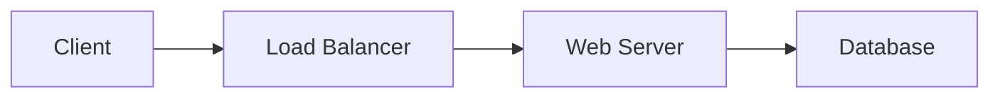

# Development Guide

This guide provides instructions for developing and maintaining the TechMaster Learning Notes documentation site.

## Prerequisites

- Python 3.12 or higher
- pipenv (for dependency management)
- Git (for version control)

## Setup

### 1. Install Dependencies

```bash
# Install pipenv if not already installed
pip install pipenv

# Install project dependencies
pipenv install
```

### 2. Activate Virtual Environment

```bash
pipenv shell
```

## Development Workflow

### Local Development Server

Start the development server with live reload:

```bash
pipenv run dev
```

The site will be available at `http://127.0.0.1:8000`. Changes to markdown files will automatically reload the browser.

### Building the Site

Build the static site for production:

```bash
pipenv run build
```

The built site will be in the `site/` directory.

### Validation and Linting

#### Content Validation

Validate content for broken links and common issues:

```bash
pipenv run validate
```

This checks for:
- Broken internal links
- Empty markdown files
- Missing title headings
- Unclosed code blocks
- Missing metadata

#### Markdown Linting

Check markdown formatting consistency:

```bash
pipenv run lint
```

This checks for:
- Trailing whitespace
- Multiple consecutive blank lines
- Inconsistent heading styles
- Missing spaces after markers

### Run All Tests

Run all validation, linting, and build checks:

```bash
pipenv run test
```

## Content Creation Workflow

### 1. Create New Content

Follow the established directory structure:

```
docs/
├── aws/                    # AWS service documentation
├── certifications/         # Certification study materials
├── other-technologies/     # Non-AWS technologies
└── resources/             # Shared resources
```

### 2. Use Content Templates

Templates are available in `docs/templates/`:

- `aws-service-template.md` - For AWS service pages
- `certification-template.md` - For certification materials
- `technology-template.md` - For other technologies

### 3. Add Page Metadata

Include YAML frontmatter at the top of each page:

```yaml
---
title: "Page Title"
description: "Brief description for SEO"
tags: ["aws", "compute", "ec2"]
certification: ["solutions-architect"]
difficulty: "beginner"
---
```

### 4. Update Navigation

Edit `mkdocs.yml` to add new pages to the navigation structure:

```yaml
nav:
  - Section Name:
    - Page Title: path/to/page.md
```

### 5. Validate Content

Before committing, run validation:

```bash
pipenv run validate
```

### 6. Test Locally

Preview your changes:

```bash
pipenv run dev
```

### 7. Build and Verify

Build the site to catch any issues:

```bash
pipenv run build
```

## Content Guidelines

### Markdown Formatting

- Use ATX-style headings (`# Heading`)
- Add blank lines before and after headings
- Use fenced code blocks with language identifiers
- Include alt text for images
- Use relative links for internal references

### Code Examples

```python
# Use syntax highlighting
def example_function():
    return "Hello, World!"
```

### Diagrams

Use Mermaid for architecture diagrams:



### Admonitions

Use admonitions for important information:

```markdown
!!! note
    This is a note

!!! warning
    This is a warning

!!! tip
    This is a tip
```

## Testing

### Pre-commit Checklist

Before committing changes:

1. ✅ Run validation: `pipenv run validate`
2. ✅ Run linting: `pipenv run lint`
3. ✅ Build site: `pipenv run build`
4. ✅ Test locally: `pipenv run dev`
5. ✅ Review changes in browser

### Common Issues

#### Build Fails

- Check for syntax errors in `mkdocs.yml`
- Verify all referenced files exist
- Check for unclosed code blocks
- Review error messages in build output

#### Broken Links

- Use relative paths for internal links
- Verify file paths are correct
- Check for typos in filenames

#### Missing Content

- Ensure all navigation items point to existing files
- Create placeholder pages for incomplete sections

## Project Structure

```
.
├── docs/                   # Content directory
│   ├── aws/               # AWS documentation
│   ├── certifications/    # Certification materials
│   ├── other-technologies/# Other tech docs
│   ├── resources/         # Shared resources
│   ├── includes/          # Reusable snippets
│   ├── javascripts/       # Custom JavaScript
│   ├── stylesheets/       # Custom CSS
│   └── templates/         # Content templates
├── scripts/               # Development scripts
│   ├── dev.py            # Development server
│   ├── build.py          # Build script
│   ├── validate.py       # Content validation
│   └── lint.py           # Markdown linting
├── site/                  # Built site (generated)
├── mkdocs.yml            # MkDocs configuration
├── Pipfile               # Python dependencies
└── DEVELOPMENT.md        # This file
```

## Deployment

### Manual Deployment

1. Build the site: `pipenv run build`
2. Deploy the `site/` directory to your hosting platform

### GitHub Pages Deployment

Deploy directly to GitHub Pages:

```bash
pipenv run deploy
```

### Automated Deployment

For automated deployment with CI/CD:

- **GitHub Pages**: Use `pipenv run deploy` in GitHub Actions
- **Netlify**: Connect repository and set build command to `pipenv run build`

## Troubleshooting

### Python Not Found

Ensure Python is installed and in your PATH:

```bash
python --version
```

### Dependencies Not Installed

Reinstall dependencies:

```bash
pipenv install --dev
```

### Port Already in Use

If port 8000 is in use, use the serve command with custom address:

```bash
pipenv run serve -a 127.0.0.1:8001
```

## Available Pipenv Scripts

The following scripts are available via `pipenv run <script>`:

- `dev` - Start development server with live reload
- `build` - Build static site for production
- `validate` - Validate content for issues
- `lint` - Check markdown formatting
- `test` - Run all validation and build checks
- `serve` - Start MkDocs server (alternative to dev)
- `deploy` - Deploy to GitHub Pages

## Additional Resources

- [MkDocs Documentation](https://www.mkdocs.org/)
- [Material for MkDocs](https://squidfunk.github.io/mkdocs-material/)
- [Markdown Guide](https://www.markdownguide.org/)
- [Mermaid Documentation](https://mermaid.js.org/)

## Support

For issues or questions:

1. Check this development guide
2. Review MkDocs documentation
3. Check existing issues in the repository
4. Create a new issue with details
