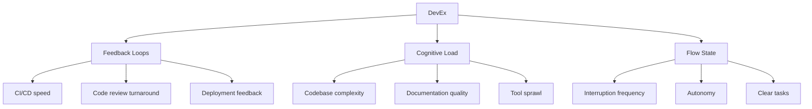
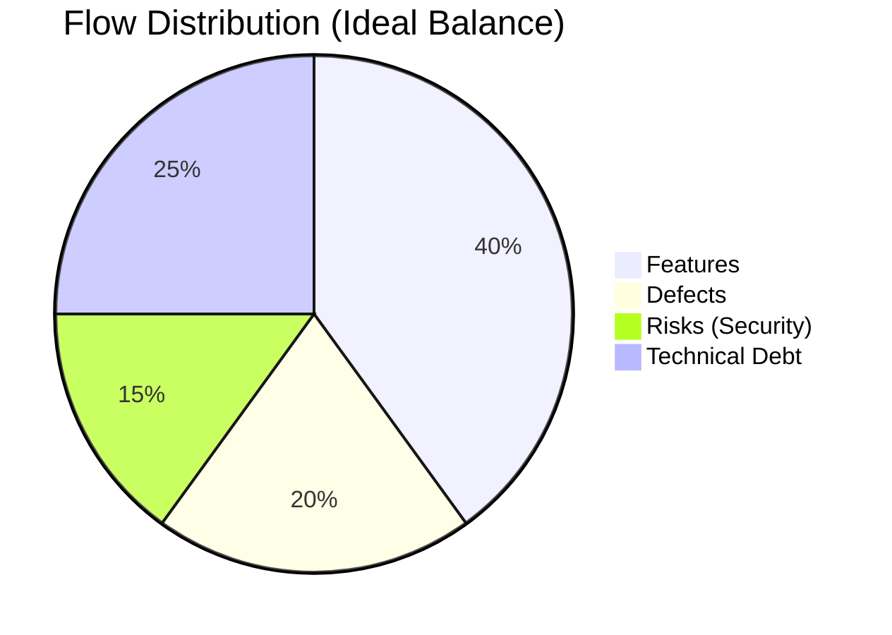
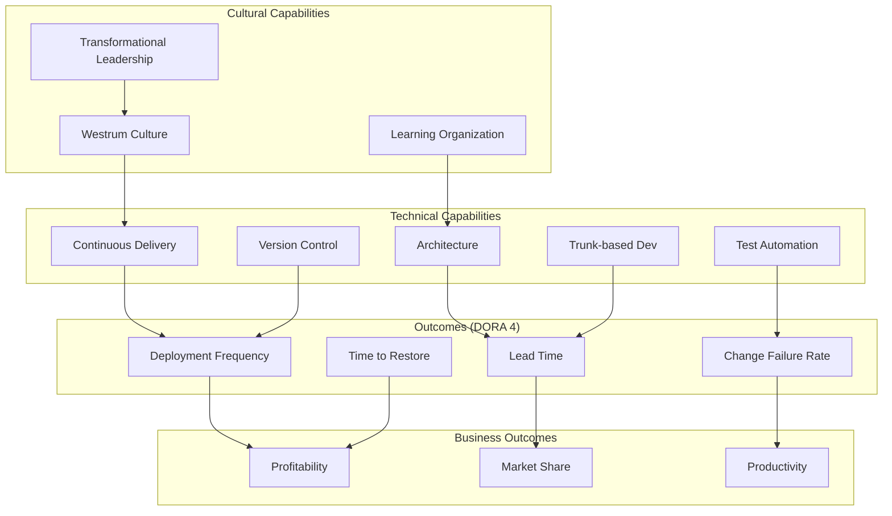
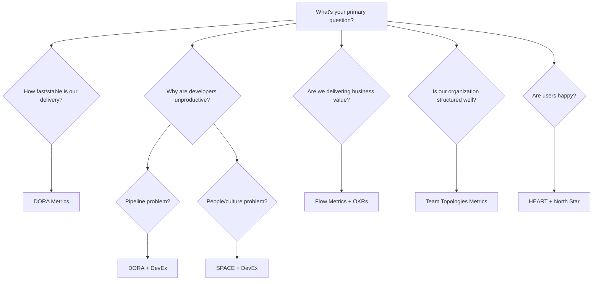

# Alternatives to DORA Metrics

!!! info "Context"
    DORA metrics focus on **delivery performance** (speed + stability). But software engineering is multidimensional — other frameworks measure developer experience, flow efficiency, value delivery, and organizational health. This page maps the landscape.

---

## Framework Comparison at a Glance

| Framework | Focus Area | Created By | Best For |
|-----------|-----------|------------|----------|
| **DORA** | Delivery performance | Google/DORA Team | DevOps maturity |
| **SPACE** | Developer productivity (holistic) | GitHub/Microsoft Research | Understanding productivity without gaming |
| **DevEx** | Developer experience | DX (Abi Noda et al.) | Improving day-to-day developer satisfaction |
| **Flow Metrics** | Value stream efficiency | Dr. Mik Kersten (Tasktop/Planview) | Connecting engineering to business outcomes |
| **Accelerate** | Organizational performance | Forsgren, Humble, Kim | Transformational leadership |
| **Engineering Benchmarks** | Industry comparison | LinearB, Sleuth, Jellyfish | Competitive positioning |
| **Team Topologies Metrics** | Team interaction patterns | Skelton & Pais | Organizational design |
| **Lean Metrics** | Waste elimination | Toyota/Lean Movement | Process efficiency |
| **OKRs for Engineering** | Goal alignment | Intel/Google | Strategic alignment |

---

## 1. SPACE Framework

### Overview

Developed by **GitHub, Microsoft Research, and University of Victoria** (2021). Published in ACM Queue by Nicole Forsgren (same researcher behind DORA).

!!! quote "Core Idea"
    Developer productivity cannot be reduced to a single dimension. SPACE captures five dimensions that must be measured together to avoid misleading conclusions.

### The Five Dimensions

| Dimension | What It Measures | Example Metrics |
|-----------|-----------------|-----------------|
| **S**atisfaction & Well-being | How developers feel about their work | Survey scores, retention, burnout indicators |
| **P**erformance | Outcomes of the work | Code quality, reliability, customer impact |
| **A**ctivity | Count of actions (use carefully!) | Commits, PRs, deployments, code reviews |
| **C**ommunication & Collaboration | How people work together | PR review turnaround, knowledge sharing, meeting load |
| **E**fficiency & Flow | Ability to do work with minimal interruption | Flow state time, handoffs, wait time, build times |

### How It Differs from DORA

| Aspect | DORA | SPACE |
|--------|------|-------|
| Scope | Delivery pipeline only | Full developer work experience |
| Data type | Objective system metrics | Mix of surveys + system metrics |
| Dimensions | 4 metrics | 5 dimensions, many possible metrics |
| Risk of gaming | Low (balanced set) | Low (multi-dimensional by design) |
| Ease of implementation | Medium (needs CI/CD data) | Hard (needs surveys + tooling) |

### When to Choose SPACE over DORA

- You want to understand **why** teams are slow, not just **that** they're slow
- Leadership is tempted to use activity metrics (commits/day) — SPACE provides a safer framework
- Developer retention/burnout is a concern
- You need to justify investment in developer experience

---

## 2. DevEx (Developer Experience)

### Overview

Created by **Abi Noda, Margaret-Anne Storey, Nicole Forsgren, and Michaela Greiler** (2023). Focuses specifically on what makes developers productive and happy.

### The Three Core Dimensions



| Dimension | What It Means | Metrics |
|-----------|--------------|---------|
| **Feedback Loops** | How fast developers get signal on their work | CI time, PR review time, test execution speed, deploy time |
| **Cognitive Load** | Mental effort to understand and change code | Onboarding time, context switches, documentation gaps |
| **Flow State** | Uninterrupted productive time | Deep work hours, meeting-free time, focus time |

### Key Differences from DORA

| Aspect | DORA | DevEx |
|--------|------|-------|
| Perspective | System/pipeline centric | Developer/human centric |
| Measurement | Automated from systems | Surveys + some system metrics |
| Actionability | "Fix the pipeline" | "Fix the developer environment" |
| Output | 4 numbers | Qualitative + quantitative insights |

### When to Choose DevEx over DORA

- Your pipeline is fine but developers are still unhappy/unproductive
- High turnover despite good delivery metrics
- Onboarding takes too long
- Developers complain about tooling, processes, or cognitive overload

---

## 3. Flow Metrics (Value Stream Management)

### Overview

Created by **Dr. Mik Kersten** in *Project to Product* (2018). Based on the idea that software organizations should be managed as **product value streams**, not project factories.

### The Flow Framework

| Metric | What It Measures | Formula |
|--------|-----------------|---------|
| **Flow Velocity** | Number of flow items completed per unit time | Items completed / time period |
| **Flow Efficiency** | Ratio of active time to total time | Active time / (Active + Wait time) × 100 |
| **Flow Time** | Total time from start to done | End timestamp − Start timestamp |
| **Flow Load** | Work in progress (WIP) | Count of items in active states |
| **Flow Distribution** | Balance of work types | % features vs. % defects vs. % risks vs. % debt |

### The Four Flow Item Types



| Flow Item | Business Value | Example |
|-----------|---------------|---------|
| **Features** | New value to customers | New API endpoint, UI feature |
| **Defects** | Quality improvement | Bug fixes, data corrections |
| **Risks** | Compliance/security | CVE patches, audit remediation |
| **Debt** | Future velocity | Refactoring, dependency upgrades |

### How It Differs from DORA

| Aspect | DORA | Flow Metrics |
|--------|------|-------------|
| Lens | Engineering delivery | Business value stream |
| Granularity | Code change level | Work item level (epic/story) |
| Audience | Engineering leaders | Product + Engineering + Business |
| Key insight | "How fast/stable is our pipeline?" | "Are we delivering the right mix of work?" |
| Tool ecosystem | GitHub, CI/CD | Jira, Azure DevOps, Planview |

### When to Choose Flow Metrics over DORA

- You need to connect engineering work to **business outcomes**
- Stakeholders don't care about deployment frequency — they care about feature delivery
- You're drowning in tech debt and need to make the case for investment
- You want to visualize **where time is wasted** (wait states, handoffs)

---

## 4. Accelerate Metrics (Extended DORA)

### Overview

The full model from the book *Accelerate* (Forsgren, Humble, Kim) includes DORA metrics PLUS organizational capabilities that drive them.

### Beyond the Four Metrics



### The 24 Capabilities

| Category | Capabilities |
|----------|-------------|
| **Continuous Delivery** | Version control, deployment automation, trunk-based dev, CI, test automation, test data management, shift-left security, CD |
| **Architecture** | Loosely coupled, empowered teams, microservices (when appropriate) |
| **Product & Process** | Customer feedback, team experimentation, work visibility, working in small batches, WIP limits |
| **Lean Management** | Change approval processes, monitoring, proactive notification, WIP limits |
| **Cultural** | Westrum organizational culture, learning culture, collaboration, job satisfaction, identity |

### When to Choose Accelerate over DORA alone

- You have DORA numbers but don't know **how to improve** them
- You need a roadmap of capabilities to invest in
- Cultural/organizational change is needed, not just tooling

---

## 5. Engineering Intelligence Platforms

These are commercial products that provide their own metric frameworks, often combining DORA with additional signals.

### Platform Comparison

| Platform | Unique Metrics Beyond DORA | Best For |
|----------|---------------------------|----------|
| **Sleuth** | Deploy frequency per service, impact score, code churn | Multi-service deployment tracking |
| **LinearB** | Cycle time breakdown, review depth, planning accuracy, investment balance | R&D efficiency + DORA |
| **Jellyfish** | Engineering investment, allocation, strategic alignment | Engineering-to-business alignment |
| **Swarmia** | Working agreements, collaboration patterns, initiative progress | Team health + delivery |
| **Faros AI** | Custom composite metrics, connector-based | Enterprise with many tools |
| **Pluralsight Flow** (formerly GitPrime) | Active days, commit patterns, code review metrics | Individual contributor patterns |
| **Propelo** (Harness SEI) | Trellis scores, sprint metrics, DORA + custom | End-to-end software engineering |
| **Waydev** | Work log analysis, collaboration metrics | Remote team productivity |
| **Code Climate Velocity** | Cycle time, throughput, code churn | Small-medium teams |
| **Haystack** | Maker time, context switching, deep work | Developer focus/wellbeing |

### What They Typically Measure (Beyond DORA)

| Category | Metrics |
|----------|---------|
| **Cycle Time Breakdown** | Coding time, pickup time, review time, deploy time |
| **Review Metrics** | Review depth, review turnaround, review iterations |
| **Planning Metrics** | Sprint completion rate, estimate accuracy, scope creep |
| **Investment Metrics** | % time on features vs. debt vs. bugs vs. ops |
| **Collaboration** | Knowledge silos, bus factor, code ownership |
| **Code Health** | Churn rate, rework rate, legacy code ratio |

---

## 6. Team Topologies Metrics

### Overview

Based on *Team Topologies* (Skelton & Pais, 2019). Measures how **team interactions** affect delivery, not just the delivery itself.

### Key Metrics

| Metric | What It Measures | Why It Matters |
|--------|-----------------|----------------|
| **Team Cognitive Load** | How much a team has to understand | Overloaded teams are slow regardless of pipeline |
| **Interaction Mode Fitness** | Are team interactions appropriate? | X-as-a-Service vs. Collaboration vs. Facilitating |
| **Flow of Change** | Can a team deliver independently? | Dependencies kill deployment frequency |
| **Team API Clarity** | How well-defined are team boundaries? | Unclear boundaries = coordination overhead |

### When to Use

- DORA metrics are poor despite good tooling — the problem is organizational
- Teams are constantly blocked on other teams
- New services keep being assigned to already-overloaded teams

---

## 7. Lean Software Development Metrics

### Overview

Adapted from Toyota Production System. Focuses on **eliminating waste** in the development process.

### The Seven Wastes of Software

| Waste | Software Equivalent | Metric |
|-------|-------------------|--------|
| **Overproduction** | Building features nobody uses | Feature adoption rate |
| **Inventory** | Unmerged branches, unreleased code | WIP count, branch age |
| **Motion** | Context switching, tool switching | Focus time, tool changes/day |
| **Waiting** | PR waiting for review, deploy queues | Queue time per stage |
| **Transportation** | Handoffs between teams | Handoff count per work item |
| **Over-processing** | Unnecessary approvals, ceremony | Process steps per change |
| **Defects** | Bugs found after release | Escape rate, rework ratio |

### Lean Metrics Set

| Metric | Formula | Target |
|--------|---------|--------|
| **Cycle Efficiency** | Value-add time / Total time | > 40% |
| **Process Efficiency** | Flow time / Touch time | Minimize |
| **Batch Size** | Avg changes per deployment | Small |
| **Queue Depth** | Items waiting at each stage | Near zero |
| **Rework Ratio** | Rework effort / Total effort | < 10% |

---

## 8. Google's DORA + Reliability (5th Metric)

### Overview

In 2021, Google's DORA team added **Operational Performance (Reliability)** as a de facto 5th metric, acknowledging that the original 4 don't capture whether the system is actually meeting user expectations.

### The 5th Metric: Reliability

| Aspect | Details |
|--------|---------|
| **What** | Are you meeting your Service Level Objectives (SLOs)? |
| **How** | % of time services are within SLO targets |
| **Why** | You can have fast deploys and quick recovery but still have a bad user experience (e.g., latency just under incident threshold) |
| **Measurement** | SLI (Service Level Indicator) adherence over time |

### How It Extends DORA

```
Original DORA = Throughput (DF + LT) + Stability (CFR + MTTR)
Extended DORA = Throughput + Stability + Reliability (SLO adherence)
```

---

## 9. Outcome-Based Alternatives

### North Star Metrics (Product-Led)

Instead of measuring engineering process, measure **what users actually experience**:

| Metric | What It Tells You |
|--------|-------------------|
| Time to first value | How fast can a new user get value? |
| Feature adoption rate | Are we building the right things? |
| Error rate (user-facing) | Is the system reliable from user perspective? |
| Time to resolve user issue | End-to-end from user report to fix |

### HEART Framework (Google)

Designed for user-facing products:

| Dimension | Meaning | Example Metric |
|-----------|---------|----------------|
| **H**appiness | User satisfaction | NPS, satisfaction survey |
| **E**ngagement | Level of usage | DAU/MAU, session length |
| **A**doption | New users/features | Sign-ups, feature first-use |
| **R**etention | Users coming back | Churn rate, renewal rate |
| **T**ask Success | Can users complete goals? | Task completion rate, error rate |

---

## Decision Guide: Which Framework to Use



### Quick Decision Matrix

| If your problem is... | Use this framework |
|----------------------|-------------------|
| "We deploy too slowly" | DORA |
| "We deploy fast but users are unhappy" | HEART + SLOs |
| "Developers are burned out" | SPACE + DevEx |
| "We ship features nobody wants" | Flow Metrics + HEART |
| "Teams are always blocked on each other" | Team Topologies |
| "We can't justify engineering investment to the board" | Flow Metrics + Jellyfish |
| "We don't know what to improve first" | Accelerate (24 capabilities) |
| "We want a comprehensive view" | DORA + SPACE + Flow (layered) |

---

## Combining Frameworks (Recommended Approach)

Most mature organizations don't pick one — they layer them:

```
Layer 1 (Foundation):  DORA Metrics         → Are we delivering well?
Layer 2 (Experience):  DevEx / SPACE        → Are developers effective and happy?
Layer 3 (Value):       Flow Metrics         → Are we delivering the right things?
Layer 4 (Business):    OKRs + North Star    → Are we achieving business goals?
```

### Example: Combined Dashboard Sections

| Section | Metrics | Source |
|---------|---------|--------|
| Delivery Health | DF, LT, CFR, MTTR | DORA |
| Developer Experience | CI wait time, review time, focus hours | DevEx |
| Value Flow | Feature ratio, flow efficiency, flow velocity | Flow Framework |
| Product Impact | Adoption, engagement, task success | HEART |
| Team Health | Cognitive load, dependencies, satisfaction | SPACE + Team Topologies |

---

## Resources

### Books

- *Accelerate* — Forsgren, Humble, Kim (DORA deep-dive)
- *Project to Product* — Mik Kersten (Flow Framework)
- *Team Topologies* — Skelton & Pais (Team structure metrics)
- *The Phoenix Project* — Kim, Behr, Spafford (Lean + DevOps narrative)

### Papers

- [The SPACE of Developer Productivity](https://queue.acm.org/detail.cfm?id=3454124) — ACM Queue (2021)
- [DevEx: What Actually Drives Productivity](https://queue.acm.org/detail.cfm?id=3595878) — ACM Queue (2023)
- [State of DevOps Reports](https://dora.dev/research/) — Annual DORA research

### Related Pages

- [DORA Metrics - First Principles](./index.md)
- [DORA Implementation Tech Stack](./implementation.md)

---

**Tags**: #dora #devops #metrics #space #devex #flow-metrics #engineering-intelligence

**Difficulty**: <span class="difficulty-intermediate">Intermediate</span>
