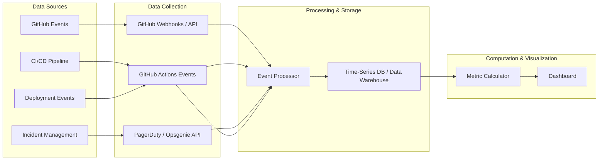
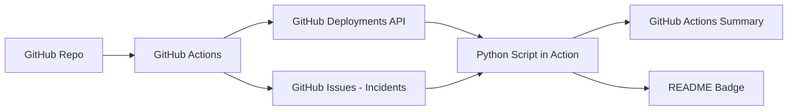
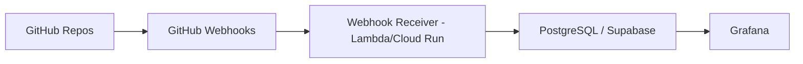

# End-to-End Tech Stack for DORA Metrics Implementation

!!! info "Context"
    This guide maps the complete technology stack needed to measure all four DORA metrics for a **GitHub-hosted repository** (like this TechMaster project). It covers data collection, event processing, storage, computation, and visualization.

---

## Architecture Overview



---

## Layer-by-Layer Tech Stack

### Layer 1: Source Control & Events (Data Source)

| Component | Technology | Purpose |
|-----------|-----------|---------|
| Source Control | **GitHub** | Commits, PRs, merge events |
| Branch Strategy | **Trunk-based development** | Enables meaningful Lead Time measurement |
| Tagging/Releases | **GitHub Releases / Tags** | Marks deployment points |

**What you get from GitHub**:

- Commit timestamps (for Lead Time start)
- PR merge events (for change tracking)
- Push-to-main events (for deployment triggers)
- Release/tag creation events

---

### Layer 2: CI/CD Pipeline (Deployment Engine)

This is where deployments actually happen — you need a pipeline that deploys AND emits events.

| Component | Technology Options | Purpose |
|-----------|-------------------|---------|
| CI/CD Engine | **GitHub Actions** | Build, test, deploy |
| Deployment Target | **GitHub Pages** (for this repo) | Where the site runs |
| Deployment Tracking | **GitHub Deployments API** | Records deployment events with status |

#### GitHub Actions Workflow (Required)

```yaml
# .github/workflows/deploy.yml
name: Deploy & Track DORA

on:
  push:
    branches: [main]

jobs:
  deploy:
    runs-on: ubuntu-latest
    environment: production
    steps:
      - uses: actions/checkout@v4
        with:
          fetch-depth: 0  # Full history needed for Lead Time calculation

      - name: Set up Python
        uses: actions/setup-python@v5
        with:
          python-version: '3.12'

      - name: Install dependencies
        run: pip install pipenv && pipenv install

      - name: Build site
        run: pipenv run build

      - name: Deploy to GitHub Pages
        uses: peaceiris/actions-gh-pages@v4
        with:
          github_token: ${{ secrets.GITHUB_TOKEN }}
          publish_dir: ./site

      - name: Record Deployment Event
        uses: actions/github-script@v7
        with:
          script: |
            const deployment = await github.rest.repos.createDeployment({
              owner: context.repo.owner,
              repo: context.repo.repo,
              ref: context.sha,
              environment: 'production',
              auto_merge: false,
              required_contexts: []
            });
            
            await github.rest.repos.createDeploymentStatus({
              owner: context.repo.owner,
              repo: context.repo.repo,
              deployment_id: deployment.data.id,
              state: 'success',
              environment_url: 'https://ciw8981.github.io/TechMaster/'
            });
```

---

### Layer 3: Data Collection (Event Capture)

You need to capture events from multiple sources and normalize them.

| Component | Technology Options | Purpose |
|-----------|-------------------|---------|
| Webhook Receiver | **GitHub Webhooks** → Lambda/Cloud Function | Real-time event ingestion |
| API Polling | **GitHub REST/GraphQL API** | Batch data collection |
| Event Bus | **GitHub Actions** (simplest) / **AWS EventBridge** / **Apache Kafka** | Event routing |
| Incident Source | **PagerDuty** / **Opsgenie** / **GitHub Issues with labels** | Failure/incident tracking |

#### Option A: Lightweight (GitHub-native)

For a repo like TechMaster, you can compute everything from GitHub data alone:

```yaml
# Data sources mapped to DORA metrics:
Deployment Frequency:  GitHub Deployments API (deployment events)
Lead Time for Changes: GitHub Commits API (first commit → deployment timestamp)
Change Failure Rate:   GitHub Issues (labeled 'incident' or 'hotfix') / total deployments
Time to Restore:       GitHub Issues (time from 'incident' label to 'resolved' label)
```

#### Option B: Enterprise (Multi-tool)

| Metric | Data Source | Collection Method |
|--------|-------------|-------------------|
| Deployment Frequency | CI/CD deployment events | Webhook → Event store |
| Lead Time | Git commits + deployment timestamps | GitHub API + CI/CD timestamps |
| Change Failure Rate | Incident management + deployment count | PagerDuty API + CI/CD |
| Time to Restore | Incident open/close timestamps | PagerDuty/Opsgenie API |

---

### Layer 4: Data Storage (Persistence)

| Component | Technology Options | Purpose |
|-----------|-------------------|---------|
| **Simplest** | **GitHub Actions artifacts** + **JSON files in repo** | No infra needed |
| **Lightweight** | **SQLite** / **DuckDB** in a scheduled action | Single-file DB |
| **Scalable** | **PostgreSQL** / **AWS Timestream** / **BigQuery** | Production analytics |
| **Data Warehouse** | **Snowflake** / **Redshift** / **BigQuery** | Enterprise reporting |

#### Schema Design (Core Tables)

```sql
-- Deployments table
CREATE TABLE deployments (
    id              TEXT PRIMARY KEY,
    sha             TEXT NOT NULL,
    environment     TEXT NOT NULL,
    deployed_at     TIMESTAMP NOT NULL,
    status          TEXT NOT NULL,  -- success, failure, rollback
    triggered_by    TEXT,
    duration_seconds INTEGER
);

-- Changes (commits/PRs that went into each deployment)
CREATE TABLE changes (
    id              TEXT PRIMARY KEY,
    deployment_id   TEXT REFERENCES deployments(id),
    commit_sha      TEXT NOT NULL,
    first_commit_at TIMESTAMP NOT NULL,  -- When the change was first committed
    merged_at       TIMESTAMP,           -- When PR was merged
    author          TEXT
);

-- Incidents (failures linked to deployments)
CREATE TABLE incidents (
    id              TEXT PRIMARY KEY,
    deployment_id   TEXT REFERENCES deployments(id),
    detected_at     TIMESTAMP NOT NULL,
    resolved_at     TIMESTAMP,
    severity        TEXT,
    description     TEXT
);
```

---

### Layer 5: Metric Computation (The Math)

| Metric | Formula | Computation |
|--------|---------|-------------|
| **Deployment Frequency** | `count(deployments) / time_period` | Count deployments per day/week/month |
| **Lead Time for Changes** | `median(deployed_at - first_commit_at)` | For each change, time from first commit to deployment |
| **Change Failure Rate** | `count(failed_deployments) / count(total_deployments)` | Percentage of deployments causing incidents |
| **Time to Restore** | `median(resolved_at - detected_at)` | Time from incident detection to resolution |

#### Example: Python Calculator

```python
"""
DORA Metrics Calculator
Computes metrics from GitHub Deployments API and Issues
"""
import statistics
from datetime import datetime, timedelta
from dataclasses import dataclass


@dataclass
class DORAMetrics:
    deployment_frequency: float      # deployments per day
    lead_time_hours: float           # median hours from commit to deploy
    change_failure_rate: float       # percentage (0-100)
    time_to_restore_hours: float     # median hours to resolve


def calculate_deployment_frequency(
    deployments: list[dict], 
    period_days: int = 30
) -> float:
    """Deployments per day over the given period."""
    return len(deployments) / period_days


def calculate_lead_time(changes: list[dict]) -> float:
    """Median time (hours) from first commit to deployment."""
    lead_times = []
    for change in changes:
        commit_time = change['first_commit_at']
        deploy_time = change['deployed_at']
        delta = (deploy_time - commit_time).total_seconds() / 3600
        lead_times.append(delta)
    
    return statistics.median(lead_times) if lead_times else 0


def calculate_change_failure_rate(
    total_deployments: int,
    failed_deployments: int
) -> float:
    """Percentage of deployments that caused a failure."""
    if total_deployments == 0:
        return 0
    return (failed_deployments / total_deployments) * 100


def calculate_time_to_restore(incidents: list[dict]) -> float:
    """Median time (hours) from incident detection to resolution."""
    restore_times = []
    for incident in incidents:
        if incident.get('resolved_at'):
            delta = (incident['resolved_at'] - incident['detected_at']).total_seconds() / 3600
            restore_times.append(delta)
    
    return statistics.median(restore_times) if restore_times else 0
```

---

### Layer 6: Visualization & Dashboards

| Component | Technology Options | Purpose |
|-----------|-------------------|---------|
| **Simplest** | **GitHub Actions Summary** / **README badge** | Zero-infra visibility |
| **Lightweight** | **Grafana** (with JSON/SQLite datasource) | Beautiful dashboards |
| **Platform** | **Datadog** / **New Relic** / **Dynatrace** | Full observability suite |
| **Custom** | **Streamlit** / **Dash** / **Apache Superset** | Tailored views |
| **Enterprise** | **Tableau** / **Power BI** / **Looker** | Business intelligence |

#### GitHub Actions Summary (Zero-Cost Dashboard)

```yaml
      - name: Generate DORA Summary
        uses: actions/github-script@v7
        with:
          script: |
            const summary = `
            ## 📊 DORA Metrics (Last 30 Days)
            | Metric | Value | Rating |
            |--------|-------|--------|
            | Deployment Frequency | ${metrics.freq}/day | ${rating(metrics.freq)} |
            | Lead Time for Changes | ${metrics.leadTime}h | ${rating(metrics.leadTime)} |
            | Change Failure Rate | ${metrics.cfr}% | ${rating(metrics.cfr)} |
            | Time to Restore | ${metrics.mttr}h | ${rating(metrics.mttr)} |
            `;
            await core.summary.addRaw(summary).write();
```

---

## Complete Tech Stack Options

### Option 1: Zero-Cost (GitHub Native Only)

Best for: Small teams, open-source projects, repos like TechMaster.



| Layer | Technology | Cost |
|-------|-----------|------|
| Source Control | GitHub | Free |
| CI/CD | GitHub Actions | Free (2000 min/month) |
| Data Collection | GitHub API (in Actions) | Free |
| Storage | GitHub Actions artifacts / gist | Free |
| Computation | Python script in Actions | Free |
| Visualization | Actions summary + README badge | Free |
| Incident Tracking | GitHub Issues with labels | Free |

---

### Option 2: Mid-Scale (Open Source Stack)

Best for: Teams of 5-50, multiple repos, need historical trends.



| Layer | Technology | Cost |
|-------|-----------|------|
| Source Control | GitHub | Free / Team plan |
| CI/CD | GitHub Actions | Included |
| Data Collection | GitHub Webhooks → AWS Lambda | ~$1-5/month |
| Storage | PostgreSQL (Supabase free tier / RDS) | Free - $15/month |
| Computation | Scheduled Lambda or cron job | ~$1/month |
| Visualization | Grafana Cloud (free tier) | Free |
| Incident Tracking | PagerDuty / Opsgenie free tier | Free |

---

### Option 3: Enterprise (Managed Platforms)

Best for: Organizations with 50+ engineers, compliance needs, multi-team.

| Layer | Technology | Cost |
|-------|-----------|------|
| Source Control | GitHub Enterprise | $21/user/month |
| CI/CD | GitHub Actions / Jenkins / Harness | Varies |
| Data Collection | Sleuth / LinearB / Faros AI | $20-50/dev/month |
| Storage | Managed by platform | Included |
| Computation | Managed by platform | Included |
| Visualization | Built-in + Datadog/Grafana | Varies |
| Incident Tracking | PagerDuty / ServiceNow | $20+/user/month |

#### Dedicated DORA Platforms

| Platform | What It Does | Pricing |
|----------|-------------|---------|
| **Sleuth** | Automated DORA tracking from GitHub/GitLab | Free tier → $20/dev/month |
| **LinearB** | Dev metrics + DORA + workflow automation | Free tier → $30/dev/month |
| **Faros AI** | Engineering intelligence platform | Custom pricing |
| **Jellyfish** | Engineering management platform | Custom pricing |
| **Swarmia** | Developer productivity + DORA | $15/dev/month |
| **Propelo** (Harness SEI) | Software engineering insights | Custom pricing |
| **Four Keys** (Google OSS) | Open-source DORA implementation | Free (self-hosted) |

---

## Implementation for THIS Repo (TechMaster)

Since TechMaster is a GitHub-hosted MkDocs documentation site deployed to GitHub Pages, here's the specific stack:

### Recommended: Option 1 (GitHub Native)

```
┌─────────────────────────────────────────────────────────┐
│                    TechMaster DORA Stack                 │
├─────────────────────────────────────────────────────────┤
│                                                         │
│  Source: GitHub (git@github.com:CIW8981/TechMaster)     │
│                                                         │
│  Pipeline: GitHub Actions                               │
│    ├── On push to main → Build → Deploy to GH Pages    │
│    ├── Record deployment via Deployments API            │
│    └── Weekly cron: compute & report DORA metrics       │
│                                                         │
│  Incident Tracking: GitHub Issues                       │
│    ├── Label: "incident" (site broken/wrong content)    │
│    └── Label: "resolved" (close issue when fixed)       │
│                                                         │
│  Data Storage: GitHub Gist or repo JSON file            │
│    └── dora-metrics.json (rolling 90-day history)       │
│                                                         │
│  Visualization:                                         │
│    ├── GitHub Actions workflow summary                  │
│    ├── README badge (shields.io dynamic badge)          │
│    └── Optional: MkDocs page with embedded chart        │
│                                                         │
└─────────────────────────────────────────────────────────┘
```

### Files You'd Need to Create

```
.github/
├── workflows/
│   ├── deploy.yml              # Build + deploy + record deployment
│   └── dora-metrics.yml        # Weekly DORA computation
├── scripts/
│   └── calculate_dora.py       # Metric computation logic
└── ISSUE_TEMPLATE/
    └── incident.yml            # Template for tracking incidents
```

---

## Technology Decision Matrix

Use this to pick the right tool at each layer:

| Decision Factor | GitHub Native | Open Source Stack | Managed Platform |
|----------------|---------------|-------------------|------------------|
| Setup time | 1-2 hours | 1-2 days | 30 minutes |
| Ongoing maintenance | Low | Medium | None |
| Cost | Free | $5-20/month | $15-50/dev/month |
| Multi-repo support | Manual | Yes | Yes |
| Historical trends | Limited | Full | Full |
| Team size sweet spot | 1-5 | 5-50 | 50+ |
| Customizability | High | High | Low-Medium |
| Accuracy | Good | Excellent | Excellent |

---

## Key Integration Points

### What Connects to What

```mermaid
graph TB
    subgraph "Metric: Deployment Frequency"
        DF1[GitHub Actions deploy workflow] --> DF2[Deployments API event]
        DF2 --> DF3[Count per time period]
    end

    subgraph "Metric: Lead Time for Changes"
        LT1[git log - first commit timestamp] --> LT2[Deployment timestamp]
        LT2 --> LT3[Delta = deploy_time - commit_time]
    end

    subgraph "Metric: Change Failure Rate"
        CFR1[GitHub Issues labeled 'incident'] --> CFR2[Link to deployment SHA]
        CFR2 --> CFR3[Failed deploys / Total deploys]
    end

    subgraph "Metric: Time to Restore"
        TTR1[Issue created timestamp] --> TTR2[Issue closed timestamp]
        TTR2 --> TTR3[Delta = closed_at - created_at]
    end
```



---

## Summary: Minimum Viable DORA

For any repo, the absolute minimum tech you need:

| Need | Simplest Solution |
|------|-------------------|
| **Know when you deployed** | GitHub Actions + Deployments API |
| **Know when code was first written** | `git log` (already exists) |
| **Know when things broke** | GitHub Issues with a label convention |
| **Know when things were fixed** | Issue close timestamp |
| **Compute the numbers** | A Python script (~100 lines) |
| **See the results** | Workflow summary or README badge |

**Total new infrastructure required: Zero.** Everything can run inside GitHub's free tier.

---

## Resources

- [Google Four Keys (OSS)](https://github.com/dora-team/fourkeys) - Reference implementation by Google
- [GitHub Deployments API](https://docs.github.com/en/rest/deployments) - Official docs
- [DORA Quick Check](https://dora.dev/quickcheck/) - Benchmark your team
- [First Principles Questions](./index.md) - Build deeper understanding of WHY these metrics matter

---

**Tags**: #dora #devops #github-actions #metrics #implementation

**Difficulty**: <span class="difficulty-intermediate">Intermediate</span>
