# Monorepo: Understanding from First Principles

!!! info "Learning Approach"
    This guide builds understanding layer by layer — starting from the most basic concepts and arriving at real-world decisions. Each question builds on the previous answer.

---

## Layer 1: The Fundamentals

### Q1: What is a code repository?

A code repository (repo) is a storage location that tracks the complete history of a project's files. It records every change — who made it, when, and why.

At its core, a repo provides three things:

- **Version history** — roll back to any previous state
- **Collaboration** — multiple people work on the same codebase without overwriting each other
- **Single source of truth** — one canonical place where the code lives

```bash
# A repository is born
git init my-project
cd my-project
git log  # empty history, ready to track changes
```

---

### Q2: What problem does a repository solve?

Without a repository, you'd face:

| Problem | Without Repo | With Repo |
|---------|-------------|-----------|
| Tracking changes | Manual copies (`project-v2-final-FINAL.zip`) | Automatic commit history |
| Collaboration | Emailing files back and forth | Merge workflows |
| Reverting mistakes | Hope you kept a backup | `git revert` or `git checkout` |
| Understanding history | "Who changed this and why?" | `git blame`, `git log` |

A repository is fundamentally a **time machine for code** — it solves the problem of managing change over time across a team.

---

### Q3: What is the smallest unit of code that needs to be managed together?

A **package** (or module/library) — a cohesive set of files that:

- Serves a single purpose
- Has its own dependencies
- Can be versioned independently
- Has a defined public interface

```
my-package/
├── src/           # source code
├── tests/         # tests
├── package.json   # metadata + dependencies (Node.js example)
└── README.md
```

This is the atomic unit. Everything above this — how you organize multiple packages — is where the monorepo question begins.

---

## Layer 2: The Core Problem

### Q4: When you have multiple projects/packages, what are your options for organizing them?

You have exactly two fundamental choices:

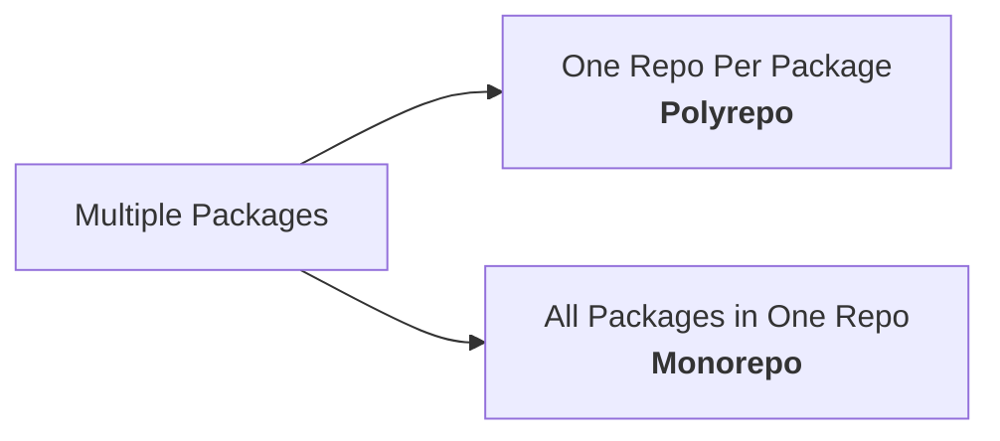

**Polyrepo** — each package gets its own repository:

```
github.com/company/auth-service      ← own repo
github.com/company/payment-service   ← own repo
github.com/company/shared-utils      ← own repo
```

**Monorepo** — all packages live in a single repository:

```
github.com/company/platform/
├── packages/auth-service/
├── packages/payment-service/
└── packages/shared-utils/
```

There is no third option. Every variation is a point on the spectrum between these two.

---

### Q5: What happens when Project A depends on Project B — how do changes propagate?

This is the question that makes repository structure matter.

**In a polyrepo:**

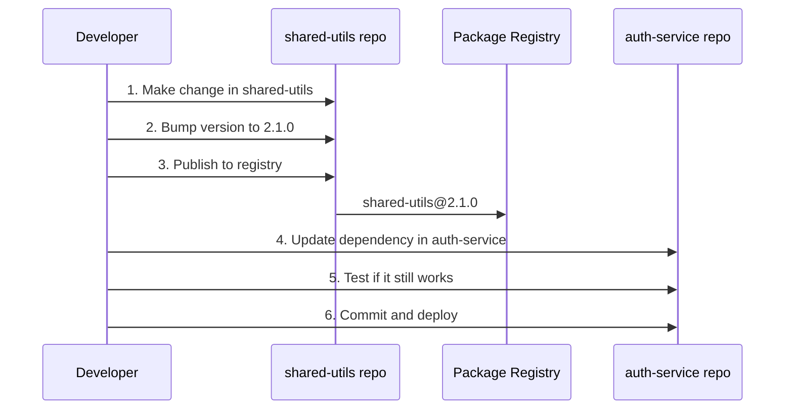

That's **6 steps across 2 repos** for a single change. If 10 services depend on `shared-utils`, multiply accordingly.

**In a monorepo:**

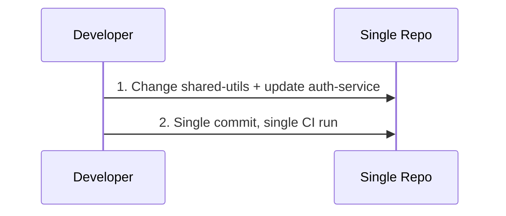

The change and its consumers are updated **atomically** in one commit.

---

### Q6: What is the cost of keeping code in separate repositories?

The costs are real and compound over time:

!!! warning "Hidden Costs of Polyrepo"

    - **Dependency hell** — version conflicts between packages across repos
    - **Diamond dependency problem** — A depends on B and C, both depend on different versions of D
    - **Sync overhead** — coordinating breaking changes across repos requires tickets, meetings, and multi-repo PRs
    - **Code duplication** — teams copy utilities rather than sharing, because sharing across repos is painful
    - **Inconsistency** — each repo drifts to its own linting rules, CI setup, and tooling versions
    - **Discovery** — hard to find existing code when it's scattered across dozens of repos

```
# The "dependency update Friday" ritual in polyrepo land:
cd auth-service && npm update shared-utils && npm test  # pray
cd payment-service && npm update shared-utils && npm test  # pray harder
cd notification-service && npm update shared-utils && npm test  # give up
```

---

## Layer 3: The Monorepo Concept

### Q7: What if you put all related code in a single repository — what changes?

Everything that was hard in polyrepo becomes easy, and new challenges emerge:

| Aspect | What Changes |
|--------|-------------|
| **Atomic changes** | One commit can update a library AND all its consumers |
| **Code sharing** | Import directly — no publishing/versioning dance |
| **Consistency** | One set of lint rules, one CI config, one toolchain |
| **Refactoring** | Rename a shared function and fix all callers in one PR |
| **Visibility** | Every developer can see and search all code |
| **Build complexity** | You now need to figure out what to build/test from a single commit |
| **Repo size** | Git operations slow down as history grows |
| **Permissions** | Everyone can see everything (may not be desired) |

The tradeoff: you exchange **coordination complexity** (polyrepo) for **tooling complexity** (monorepo).

---

### Q8: What is a monorepo vs. a monolith?

This is the most common misconception. They are completely different:

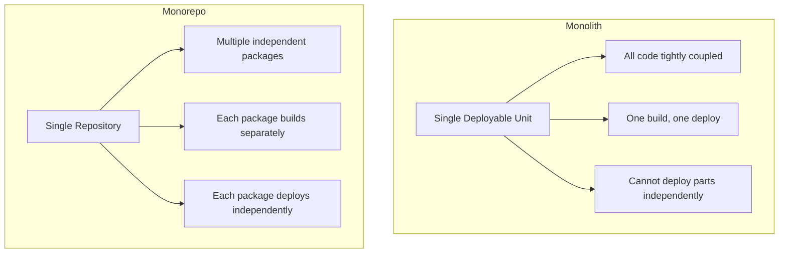

| | Monolith | Monorepo |
|---|---------|----------|
| **What's shared** | Runtime, deployment | Repository, tooling |
| **Coupling** | Tight — everything runs together | Loose — packages have clear boundaries |
| **Deploy** | All or nothing | Each package independently |
| **Example** | One giant Express app | Google, Meta, Microsoft main repos |

A monorepo **contains** multiple independently deployable units. A monolith **is** one deployable unit. You can have a monolith inside a monorepo, but they're not the same thing.

---

### Q9: What is the opposite — a polyrepo — and what tradeoffs does it make?

A polyrepo gives each project its own repository. It optimizes for **isolation** at the cost of **integration**.

| Polyrepo Wins | Polyrepo Loses |
|--------------|----------------|
| Clear ownership boundaries | Cross-repo changes are painful |
| Independent CI/CD pipelines | Dependency version drift |
| Fine-grained access control | Code duplication across repos |
| Small, fast git operations | Hard to enforce consistent standards |
| Team autonomy | Difficult large-scale refactoring |

!!! tip "When Polyrepo Makes Sense"
    - Truly independent projects with no shared code
    - Open-source projects that need separate issue trackers
    - Teams in different organizations with different access needs
    - Projects in completely different tech stacks with no overlap

---

## Layer 4: The Consequences

### Q10: If everything is in one repo, how do you build only what changed?

You don't rebuild everything — that would be wasteful. Instead, you need **change detection**:

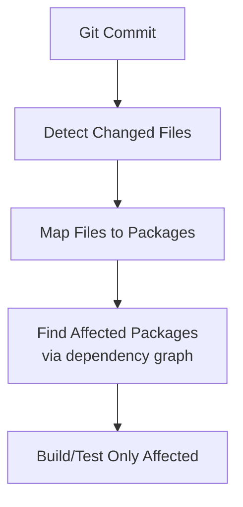

```bash
# Conceptual: what changed since last build?
git diff --name-only main...HEAD

# Output:
# packages/shared-utils/src/format.ts
# packages/auth-service/src/login.ts

# Tooling determines:
# - shared-utils changed → rebuild shared-utils
# - auth-service changed → rebuild auth-service
# - payment-service depends on shared-utils → rebuild payment-service too
# - notification-service has no relation → skip
```

This is why monorepo tooling exists — git alone doesn't understand package boundaries or dependency relationships.

---

### Q11: How do you manage dependencies between packages inside the repo?

Two types of dependencies exist in a monorepo:

**Internal dependencies** (between packages in the repo):

```json
// packages/auth-service/package.json
{
  "dependencies": {
    "@company/shared-utils": "workspace:*"
  }
}
```

The `workspace:*` protocol tells the package manager to link directly to the local source code — no publishing needed.

**External dependencies** (third-party packages):

```json
{
  "dependencies": {
    "express": "^4.18.0"
  }
}
```

!!! tip "Single Version Policy"
    Many monorepos enforce a single version of each external dependency across all packages. This eliminates version conflicts and reduces `node_modules` size.

    ```
    # Instead of each package having its own version of React:
    packages/app-a/  → react@18.2.0
    packages/app-b/  → react@18.2.0  ← same version enforced
    packages/app-c/  → react@18.2.0  ← same version enforced
    ```

---

### Q12: How do you control ownership and permissions across teams?

Since everyone has access to the entire repo, you need **code ownership** rules:

```bash
# CODEOWNERS file (GitHub/GitLab)
# Each line maps a path to the team that owns it

/packages/auth-service/       @team-identity
/packages/payment-service/    @team-payments
/packages/shared-utils/       @team-platform
/infrastructure/              @team-devops
```

This means:

- PRs touching `auth-service` require approval from `@team-identity`
- Teams can't merge changes to code they don't own without the owner's review
- Shared code changes require platform team sign-off

!!! warning "Limitation"
    Git itself has no directory-level permissions. `CODEOWNERS` is enforced by the hosting platform (GitHub, GitLab), not by git. For strict access control (e.g., secret code), polyrepo may be more appropriate.

---

### Q13: What happens to CI/CD when a single commit can touch multiple projects?

CI/CD becomes more complex but also more powerful:

**Naive approach** (don't do this):

```yaml
# Runs everything on every commit — wasteful
steps:
  - run: build-all
  - run: test-all
  - run: deploy-all
```

**Smart approach** (what monorepo tools enable):

```yaml
# Only build/test/deploy what's affected
steps:
  - run: detect-affected-packages
  - run: build --only=affected
  - run: test --only=affected
  - run: deploy --only=affected
```

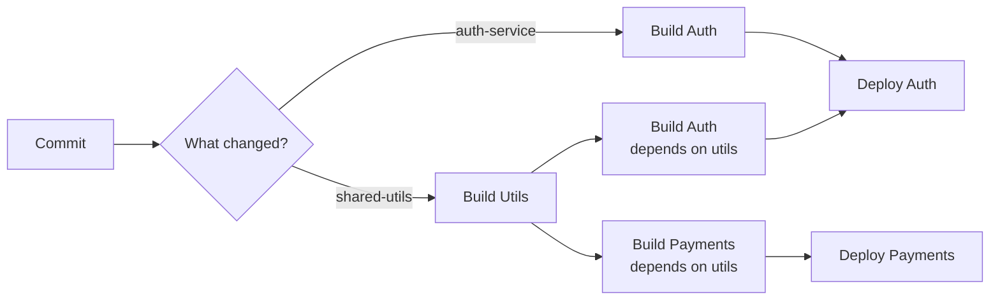

The key insight: CI/CD in a monorepo must be **graph-aware**, not file-aware.

---

### Q14: How does the repo scale when it has millions of files?

Git was designed for single projects. At scale, monorepos hit real limits:

| Problem | Scale Threshold | Symptom |
|---------|----------------|---------|
| Clone time | >1 GB repo | `git clone` takes minutes |
| Status check | >100K files | `git status` becomes slow |
| History size | >1M commits | `git log` and blame slow down |
| CI checkout | Large repo | Every CI run downloads everything |

**Solutions that exist:**

```bash
# Shallow clone — only recent history
git clone --depth=1 https://github.com/company/monorepo

# Sparse checkout — only the directories you need
git sparse-checkout init
git sparse-checkout set packages/auth-service packages/shared-utils

# Partial clone — download file contents on demand
git clone --filter=blob:none https://github.com/company/monorepo
```

!!! note "Big Tech Solutions"
    Google uses a custom VFS (Virtual File System) called Piper. Meta built a custom source control (Sapling). Microsoft built VFS for Git (now Scalar). At extreme scale, standard git isn't enough.

---

## Layer 5: The Solutions

### Q15: What is a dependency graph and why is it the core abstraction for monorepo tooling?

A dependency graph is a directed acyclic graph (DAG) where:

- **Nodes** = packages in the repo
- **Edges** = "depends on" relationships

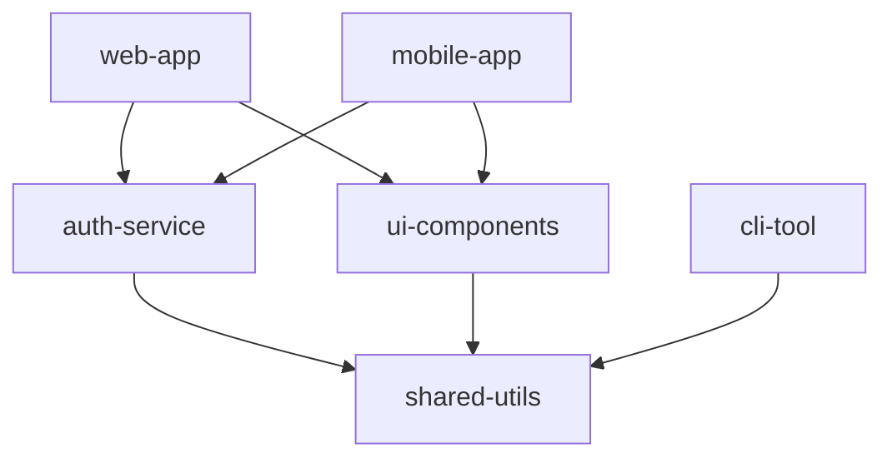

This graph is the **single most important data structure** in monorepo tooling because it answers:

- **What to build?** — traverse the graph from changed nodes
- **In what order?** — topological sort (build `shared-utils` before `auth-service`)
- **What can run in parallel?** — nodes with no dependency between them (`ui-components` and `auth-service`)
- **What's affected by a change?** — reverse traversal from the changed node

Every monorepo tool — Nx, Turborepo, Bazel — is fundamentally a **graph engine**.

---

### Q16: What does "affected" mean — how do tools determine what to rebuild/test?

"Affected" means: this package changed, OR it depends (directly or transitively) on something that changed.

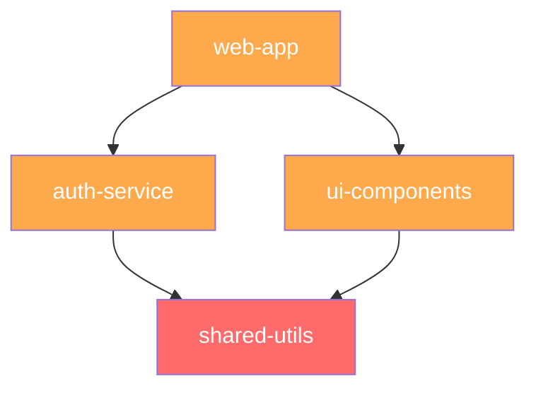

If `shared-utils` changes (red):

1. `shared-utils` — **directly changed**
2. `auth-service` — **affected** (depends on shared-utils)
3. `ui-components` — **affected** (depends on shared-utils)
4. `web-app` — **affected** (depends on auth-service AND ui-components)

```bash
# Nx example
npx nx affected --target=test  # tests only affected packages

# Turborepo example
npx turbo run test --filter=...[origin/main]
```

!!! tip "Cache"
    If a package and all its dependencies haven't changed, the build result is **cached**. This means even in a repo with 500 packages, a typical commit might only build 5-10.

---

### Q17: What are workspace protocols?

Workspace protocols are how package managers understand that multiple packages live in one repo and should be linked locally instead of downloaded from a registry.

=== "npm/Node.js"

    ```json
    // package.json (root)
    {
      "workspaces": ["packages/*"]
    }

    // packages/auth-service/package.json
    {
      "dependencies": {
        "@company/shared-utils": "workspace:*"
      }
    }
    ```

=== "Python (pip)"

    ```toml
    # Using a pyproject.toml with a tool like Hatch or PDM
    [tool.hatch.envs.default]
    dependencies = [
      "shared-utils @ {root:uri}/packages/shared-utils"
    ]
    ```

=== "Go"

    ```go
    // go.work (Go 1.18+)
    go 1.21

    use (
        ./packages/auth-service
        ./packages/shared-utils
    )
    ```

=== "Java (Maven)"

    ```xml
    <!-- pom.xml (root) -->
    <modules>
        <module>packages/auth-service</module>
        <module>packages/shared-utils</module>
    </modules>
    ```

The workspace protocol eliminates the publish-install cycle for internal dependencies.

---

### Q18: Why do dedicated tools exist — what gap do they fill that git alone can't?

Git tracks files. Monorepo tools understand **packages, dependencies, and build tasks**.

| Capability | Git | Monorepo Tool |
|-----------|-----|---------------|
| Track file changes | :white_check_mark: | :white_check_mark: |
| Understand package boundaries | :x: | :white_check_mark: |
| Dependency graph | :x: | :white_check_mark: |
| Affected analysis | :x: | :white_check_mark: |
| Task orchestration | :x: | :white_check_mark: |
| Build caching | :x: | :white_check_mark: |
| Remote caching | :x: | :white_check_mark: |

**Popular tools and their focus:**

| Tool | Language | Strength |
|------|----------|----------|
| **Nx** | JavaScript/TypeScript | Rich plugin ecosystem, code generation |
| **Turborepo** | JavaScript/TypeScript | Simple, fast, remote caching |
| **Bazel** | Any | Hermetic builds, extreme scale (Google-origin) |
| **Lerna** | JavaScript | Package publishing (now maintained by Nx) |
| **Pants** | Python/Go/Java | Python-first, fine-grained targets |
| **Rush** | JavaScript/TypeScript | Enterprise-focused (Microsoft-origin) |

---

## Layer 6: The Decision

### Q19: What are the prerequisites that make a monorepo worthwhile?

A monorepo pays off when these conditions are true:

!!! success "Strong Signals FOR Monorepo"

    - **Shared code exists** — multiple projects import common libraries
    - **Coordinated changes** — a feature often requires changes across multiple packages
    - **Consistent tooling** — you want one set of lint/test/build standards
    - **Small-to-medium team** — or a large team with strong platform engineering
    - **Rapid iteration** — you ship frequently and can't afford multi-repo coordination overhead

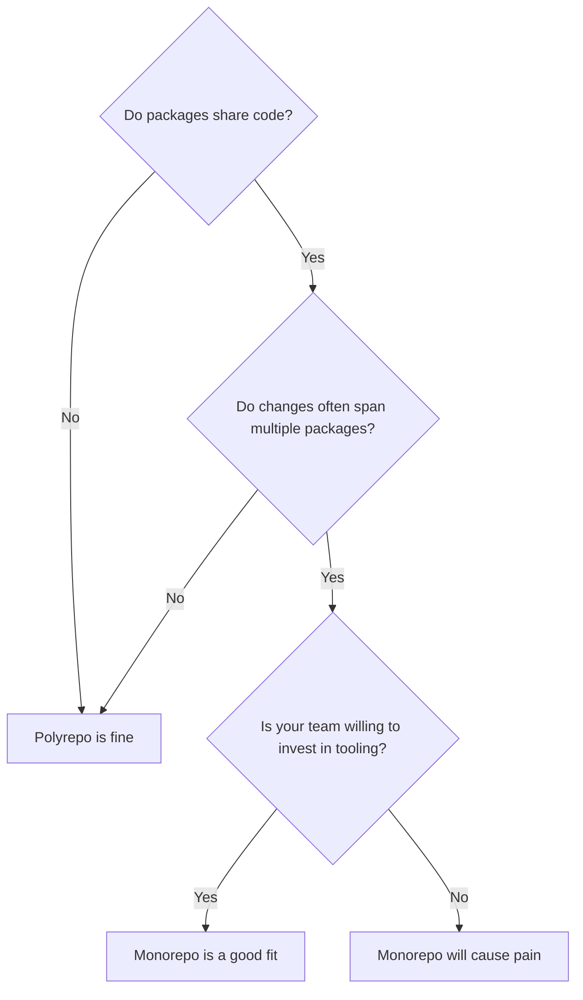

---

### Q20: What signals tell you a monorepo is the wrong choice?

!!! danger "Strong Signals AGAINST Monorepo"

    - **No shared code** — projects are truly independent with different tech stacks
    - **Strict access control** — teams must not see each other's code (regulatory, security)
    - **Massive scale without tooling investment** — a monorepo without proper tooling is worse than polyrepo
    - **Open source + proprietary mix** — hard to have public and private code in one repo
    - **Distributed teams with no shared platform team** — nobody to maintain the monorepo infrastructure

| Situation | Recommendation |
|-----------|---------------|
| 3 microservices sharing a utils library | Monorepo |
| 50 microservices, strong platform team | Monorepo |
| 2 unrelated projects in different languages | Polyrepo |
| Regulated code with strict access boundaries | Polyrepo |
| Open source library + internal apps | Separate repos |

---

## Monorepo vs Microservices: Are They the Same?

A common misconception is that "services" in a monorepo and microservices are the same concept. They're related but operate at completely different layers.

| | Monorepo | Microservices |
|---|---|---|
| **What it is** | A **code organization** strategy (where code lives) | A **runtime architecture** (how code runs) |
| **Answers the question** | "Where do I store my source code?" | "How do I deploy and run my application?" |
| **Opposite of** | Polyrepo (many repos) | Monolith (one deployable unit) |

They're **orthogonal** — you can mix and match freely:

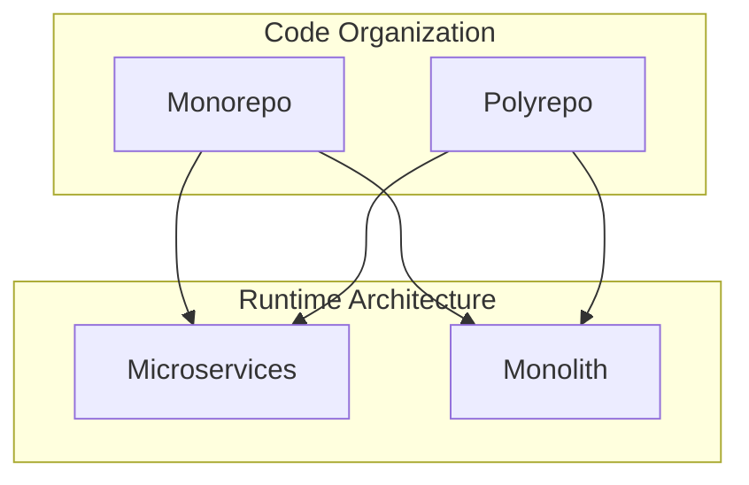

### All 4 Combinations Are Valid

| Combo | Example | Common? |
|-------|---------|---------|
| Monorepo + Microservices | All services in one repo, each deploys independently | Very common (Google, Meta) |
| Monorepo + Monolith | One repo, one big deployable app | Common for smaller teams |
| Polyrepo + Microservices | Each service in its own repo | Very common (Netflix-style) |
| Polyrepo + Monolith | One repo with one monolith | Less common but exists |

### Why the Confusion?

In a monorepo you often see a structure like this:

```
monorepo/
├── services/
│   ├── auth-service/            # looks like a microservice
│   ├── payment-service/         # looks like a microservice
│   └── notification-service/
└── packages/
    └── shared-utils/
```

Those **are** microservices — but the monorepo didn't make them microservices. They're microservices because they:

- Run as **separate processes**
- Communicate over the **network** (HTTP, gRPC, queues)
- **Deploy independently**
- **Scale independently**

The monorepo just decides they live in the same repository. At runtime, they know nothing about each other's source code.

!!! tip "Simple Mental Model"
    **Microservices** = how your app behaves in production.
    **Monorepo** = how your developers organize code on their laptops.

    One is a deployment concern, the other is a development concern. You choose them independently.

---

## Summary

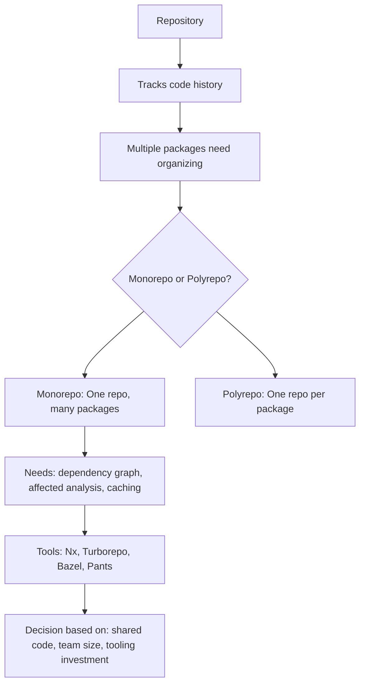

The entire monorepo concept reduces to one insight: **when code changes together, it should live together**. Everything else — the tooling, the graphs, the caching — exists to make that practical at scale.

---

## Choosing a Monorepo Tool for Next.js

Next.js itself is not a monorepo tool — it's a web framework. But it's **monorepo-friendly** thanks to `transpilePackages` in `next.config.js`, which lets it import local packages directly:

```js
// next.config.js
const nextConfig = {
  transpilePackages: ['@company/ui', '@company/shared-utils'],
}
```

The actual monorepo behavior comes from pairing Next.js with a dedicated tool.

### Quick Recommendation

| Situation | Pick |
|---|---|
| Starting fresh with Next.js | **Turborepo** |
| Need code generation, linting orchestration, deep plugins | **Nx** |
| Just 2-3 packages, want zero config | **pnpm workspaces** alone |

### Why Turborepo Is the Default Choice for Next.js

- **Same ecosystem** — Vercel builds both Next.js and Turborepo
- **Zero config to start** — `npx create-turbo@latest` gives a working monorepo with Next.js
- **Remote caching built-in** — free tier on Vercel, CI builds skip unchanged packages
- **Minimal learning curve** — just a `turbo.json` file

```json
// turbo.json
{
  "tasks": {
    "build": {
      "dependsOn": ["^build"],
      "outputs": [".next/**", "dist/**"]
    },
    "dev": {
      "persistent": true,
      "cache": false
    },
    "lint": {},
    "test": {
      "dependsOn": ["^build"]
    }
  }
}
```

A typical Turborepo + Next.js structure:

```
monorepo/
├── turbo.json
├── package.json             # workspaces defined here
├── packages/
│   ├── ui/                  # shared component library
│   └── utils/               # shared utilities
└── apps/
    ├── web/                 # Next.js app
    └── docs/                # Another Next.js app
```

### Turborepo vs Nx for Next.js

| Aspect | Turborepo | Nx |
|--------|-----------|-----|
| Setup complexity | Minimal | More config upfront |
| Next.js integration | Native (same ecosystem) | Good (via plugin) |
| Remote caching | Built-in (Vercel) | Nx Cloud (separate service) |
| Code generation | None (use Next.js CLI) | Built-in generators |
| Plugin ecosystem | Lean — does one thing | Rich — linting, testing, deploy plugins |
| Config surface | `turbo.json` only | `nx.json`, `project.json` per package |
| Best for | Speed, simplicity | Large teams needing guardrails |

### When NOT to Pick Turborepo

!!! warning "Consider alternatives when"
    - **You need strict module boundaries** — Nx has lint rules that enforce which packages can import which
    - **You want code scaffolding** — Nx generators can create new packages from templates
    - **Non-JS packages in the same repo** — Nx or Bazel handle polyglot repos better

---

## Related Topics

- [Docker](../docker/index.md)
- [Kubernetes](../kubernetes/index.md)
- [Terraform](../terraform/index.md)
