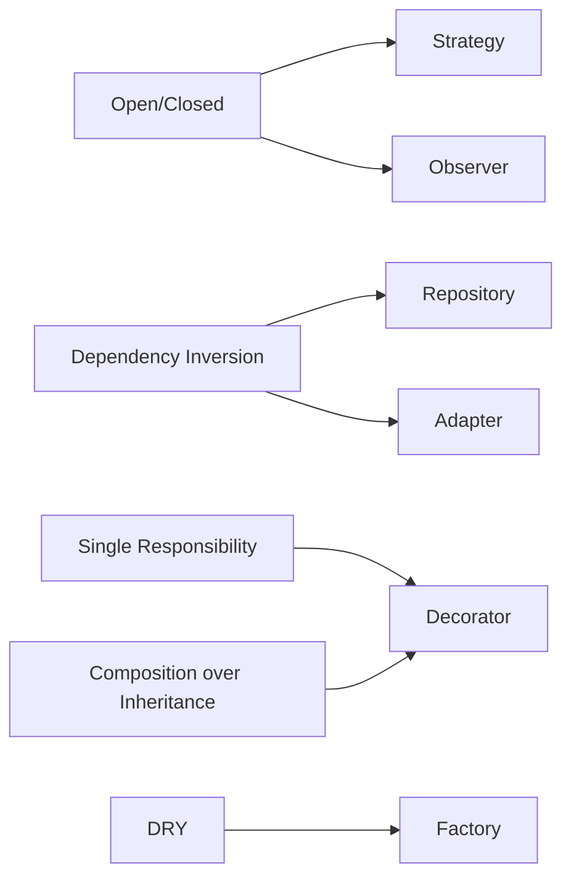

# Design Patterns

!!! info "Overview"
    **Principles** tell you *what* good design looks like; **patterns** are
    reusable recipes that achieve those principles for recurring problems. This
    section covers essential patterns from a first-principles perspective with
    Python examples.

## What is "Gang of Four"?

**Gang of Four (GoF)** refers to the four authors — Erich Gamma, Richard Helm,
Ralph Johnson, and John Vlissides — of the 1994 book *Design Patterns: Elements of
Reusable Object-Oriented Software*. It catalogued 23 classic patterns and gave the
industry a shared vocabulary. When someone says "that's a GoF pattern," they mean a
well-established, widely-understood solution.

!!! note "Apply them Pythonically"
    GoF patterns were written for statically-typed OO languages (C++, Java). In
    Python, some are simpler thanks to first-class functions and duck typing — e.g.,
    Strategy can often be "pass a function" rather than a class hierarchy. Use the
    patterns as vocabulary and structure, but implement them idiomatically.

## The Patterns

| Pattern | GoF category | Answers | Origin |
|---------|-------------|---------|--------|
| **[Strategy](strategy.md)** | Behavioral | "How do I make an algorithm swappable?" | GoF |
| **[Factory](factory.md)** | Creational | "Where does deciding-and-creating live?" | GoF |
| **[Repository](repository.md)** | — (DDD / Fowler) | "How do I hide data storage?" | Domain-Driven Design |
| **[Observer](observer.md)** | Behavioral | "How do I notify many without coupling?" | GoF |
| **[Adapter](adapter.md)** | Structural | "How do I fit an incompatible interface?" | GoF |
| **[Decorator](decorator.md)** | Structural | "How do I add behavior by wrapping?" | GoF |

### The three GoF categories

- **Creational** — how objects get *created* (Factory).
- **Structural** — how objects are *composed/wrapped* (Adapter, Decorator).
- **Behavioral** — how objects *interact/communicate* (Strategy, Observer).

## How Patterns Implement Principles

| Pattern | Primary principles it implements |
|---------|----------------------------------|
| Strategy | Open/Closed, Dependency Inversion, Composition |
| Factory | DRY, Open/Closed, Dependency Inversion |
| Repository | Dependency Inversion, Separation of Concerns, SRP |
| Observer | Open/Closed, Dependency Inversion, Separation of Concerns |
| Adapter | Dependency Inversion, Open/Closed, Liskov |
| Decorator | SRP, Open/Closed, DRY, Composition |

## Adapter vs. Decorator (both wrap)

- **Adapter** — changes the *interface* (makes an incompatible thing fit).
- **Decorator** — keeps the *same* interface but *adds behavior*.

## Related to Cloud Architecture

The **Observer** pattern is the in-process form of pub/sub — the same idea appears
as distributed infrastructure in **AWS SNS/SQS**, **EventBridge**, and **Kafka**.
See the [Observer page](observer.md) for the mapping.

## Related Topics

- [Software Design Principles (Python)](../index.md)
- [SOLID Principles (Python)](../solid-principles.md)

---

**Tags**: #python #programming #design-patterns #clean-code

**Difficulty**: Intermediate
