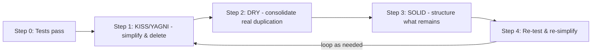

# DRY, KISS & YAGNI

!!! info "The everyday trio"
    These three principles are the day-to-day counterweight to
    [SOLID](solid-principles.md). Where SOLID pushes toward *more* structure
    (interfaces, injection, splitting), this trio pulls back toward **restraint**.
    Good design lives in the balance between them.

## Introduction

The master rule that ties everything together:

!!! quote "Complexity must be earned"
    **Complexity must be earned by real, present need.** Add abstraction (SOLID)
    only when actual variation exists; otherwise keep it simple (KISS) and don't
    build ahead (YAGNI). When you must repeat, prefer duplication over the wrong
    abstraction (DRY, done right).

| Principle | Applies to | Asks |
|-----------|-----------|------|
| **DRY** | Knowledge in the codebase | "Is this piece of knowledge defined in exactly one place?" |
| **KISS** | The solution to the current problem | "Am I solving today's problem the simplest way that works?" |
| **YAGNI** | Future problems | "Am I building for a problem I don't have yet?" |

---

## DRY — Don't Repeat Yourself

!!! abstract "Definition"
    Every piece of **knowledge** should have a single source of truth. The key
    word is *knowledge*, **not** *text*. DRY is not "eliminate code that looks
    alike" — it's "don't duplicate a decision/rule."

### The Problem

Two functions look byte-for-byte identical today:

```python
def validate_customer_signup(data):
    if not data.get("email"):
        raise ValueError("email required")
    if "@" not in data["email"]:
        raise ValueError("invalid email")
    if len(data.get("password", "")) < 8:
        raise ValueError("password too short")
    return True


def validate_admin_signup(data):
    if not data.get("email"):
        raise ValueError("email required")
    if "@" not in data["email"]:
        raise ValueError("invalid email")
    if len(data.get("password", "")) < 8:
        raise ValueError("password too short")
    return True
```

### The Fix (extract shared *knowledge*, keep entry points separate)

```python
def _validate_common_signup(data):        # shared knowledge, one place
    if not data.get("email"):
        raise ValueError("email required")
    if "@" not in data["email"]:
        raise ValueError("invalid email")
    if len(data.get("password", "")) < 8:
        raise ValueError("password too short")


def validate_customer_signup(data):
    _validate_common_signup(data)
    # customer-specific rules can go here later
    return True


def validate_admin_signup(data):
    _validate_common_signup(data)
    # admin-specific rules can go here later
    return True
```

When admin rules diverge later, they extend cleanly without touching customer code:

```python
def validate_admin_signup(data):
    _validate_common_signup(data)
    if len(data.get("password", "")) < 12:      # admin-only rule
        raise ValueError("admin password too short")
    if not data.get("mfa_enabled"):             # admin-only rule
        raise ValueError("admin requires 2FA")
    return True
```

### The Trap: The Wrong Abstraction

Merging the two into one function with a flag *looks* DRY but couples two things
that want to diverge:

```python
def validate_signup(data, is_admin=False):     # the merge trap (when it grows)
    ...
    min_len = 12 if is_admin else 8
    if is_admin and not data.get("mfa_enabled"):
        raise ValueError("admin requires 2FA")
    # ...more and more `if is_admin` branches accumulate
```

!!! warning "When the flag is OK vs. not"
    A single `min_len = 12 if is_admin else 8` is fine. The smell appears when
    `if is_admin` branches **multiply** — the function is now doing two jobs (also
    a Single Responsibility violation). Split into separate functions then.

!!! tip "Two rules of thumb"
    - **Rule of Three**: don't extract a shared abstraction until you've seen the
      same thing *three* times. Twice might be coincidence.
    - **Sandi Metz**: *"Duplication is far cheaper than the wrong abstraction."* A
      little repetition is easy to fix later; a bad shared abstraction spreads pain
      everywhere.

---

## KISS — Keep It Simple, Stupid

!!! abstract "Definition"
    Prefer the simplest solution that solves the **actual** problem. Complexity is
    a cost you pay forever — in reading, testing, and changing the code.

### The Problem

All three of these correctly answer "is `n` even?" — but they are not equal:

```python
# Simple
def is_even(n):
    return n % 2 == 0


# "Clever"
def is_even_clever(n):
    return not bool(sum(1 for _ in range(abs(n)) if _ % 2 == 0) % 2 == 0) ^ True


# "Enterprise"
class NumberParityEvaluator:
    def __init__(self, strategy):
        self.strategy = strategy
    def evaluate(self, n):
        return self.strategy.check(n)

class ModuloParityStrategy:
    def check(self, n):
        return n % 2 == 0
```

### The Costs of Unnecessary Complexity

The clever/enterprise versions impose real costs even though they return the right
answer:

- **Reading cost** — `n % 2 == 0` is understood instantly; the others must be decoded.
- **Bug surface** — more code and moving parts mean more places for bugs to hide.
- **Change cost** — every layer of indirection must be traced before you can safely
  modify anything.

### KISS vs. SOLID: Resolving the Tension

SOLID told us to use the Strategy pattern (the "enterprise" version). So when is it
right?

!!! success "The resolution"
    SOLID's abstractions are **not free** — they trade complexity now for
    flexibility later. Add abstraction **in proportion to the variation that
    actually exists.**

    - `is_even` has exactly **one** implementation forever → keep it inline (KISS wins).
    - Shipping cost has **many** real variants → use Strategy (SOLID wins).

    *Same pattern, opposite verdict — because the amount of real variation differs.*

---

## YAGNI — You Aren't Gonna Need It

!!! abstract "Definition"
    Don't build something until you **actually** need it — not when you *imagine*
    you might.

### The Problem

Requirement: "save a user's profile." YAGNI-respecting version:

```python
def save_profile(user_id, profile_data):
    db.save(user_id, profile_data)
```

Speculative "future-proofed" version for the *same* requirement:

```python
def save_profile(
    user_id,
    profile_data,
    export_format="json",        # "might need XML/CSV export someday"
    cache_strategy=None,         # "might need caching later"
    retry_count=3,               # "what if the DB is flaky?"
    async_mode=False,            # "might go async in the future"
    validators=None,             # "might need custom validation rules"
    audit_log=True,              # "compliance might want this"
):
    ...  # branches for every speculative feature
```

### Why "I'm Saving Future Work" Is a Flawed Defense

1. **You're probably guessing wrong.** When caching *actually* arrives it has
   *specific* real constraints. The speculative hook rarely matches, so you rebuild
   it anyway — doing the work **twice**.
2. **The feature may never come.** Most speculative features are never used. You
   paid a real cost today to avoid an imaginary cost that never materializes.

!!! quote "The precise counter"
    Building it now doesn't *save* future work — it **moves guessed work to the
    present** (where you have *less* information) and usually forces you to **redo
    it later** (when you finally have the real requirements). Deferring is cheaper
    *and* more accurate.

### KISS vs. YAGNI

They point the same direction but guard different doors:

- **KISS** governs *how* you build what you need → build it simply.
- **YAGNI** governs *whether* you build it at all → don't build what you don't need yet.

---

## The Refactoring Order: KISS → DRY → SOLID

When applying multiple principles, order matters. **Simplify first, then structure**
— don't build careful abstractions around code you could have deleted.



**Step 0 — Safety net.** Ensure tests exist and pass before touching anything.

**Step 1 — KISS/YAGNI.** Delete dead code, unused params, needless indirection, and
speculative abstractions. Reduce to the smallest correct code.

**Step 2 — DRY.** Now consolidate *genuine* knowledge duplication (Rule of Three).
This reveals the true responsibilities.

**Step 3 — SOLID.** Structure what remains, in this internal order:

1. **S** — split multiple reasons to change (clarifies boundaries)
2. **I** — shape focused interfaces
3. **D** — inject dependencies across boundaries (enables testing)
4. **O** — make varying parts extensible
5. **L** — verify any inheritance is truly substitutable

**Step 4 — Re-test and re-simplify.** Run tests; ask KISS again — did I
over-abstract? Remove structure that isn't earning its keep.

!!! tip "One-line mental model"
    **Delete → Simplify → De-duplicate → Structure → Re-check.**
    When SOLID and KISS disagree, **KISS wins first.** Keep **YAGNI** as the
    gatekeeper: before adding *any* abstraction, ask "do I need this now, or am I
    guessing about the future?"

---

## Summary Checklist

- [ ] **DRY**: Does each piece of *knowledge* live in exactly one place (not just deduped lookalike text)?
- [ ] **KISS**: Am I solving today's problem the simplest way that works?
- [ ] **YAGNI**: Am I building only what's needed now, not speculative features?
- [ ] Did I refactor in order: **simplify → de-duplicate → structure**?
- [ ] Is every abstraction justified by *real, present* variation?

## Related Topics

- [SOLID Principles (Python)](solid-principles.md)
- [Docker](../docker/index.md)
- [Kubernetes](../kubernetes/index.md)

---

**Tags**: #python #programming #dry #kiss #yagni #clean-code

**Difficulty**: <span class="difficulty-intermediate">Intermediate</span>
