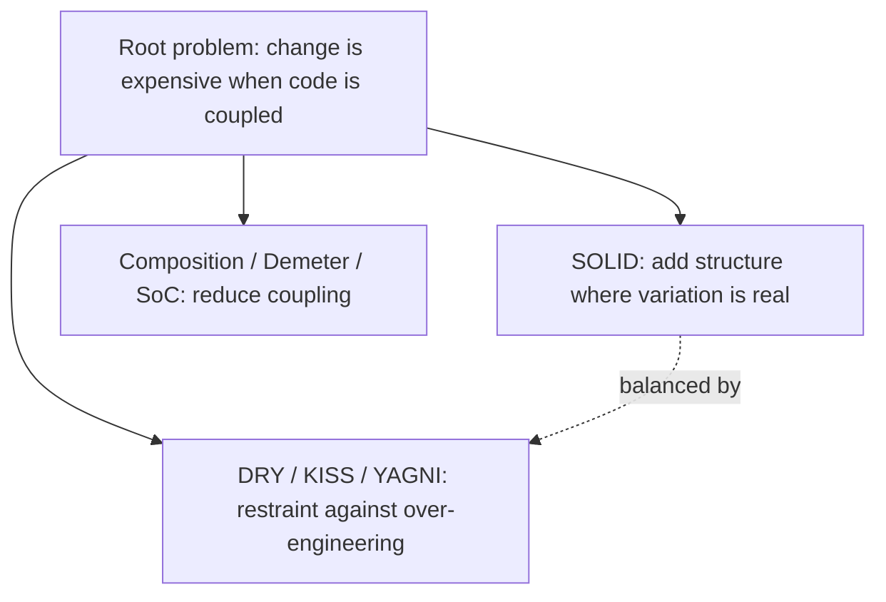

# Software Design Principles

!!! info "Overview"
    This section covers the essential principles of good software design, taught
    from a **first-principles** perspective with practical Python examples. Every
    principle answers the same root problem: *software changes over time, and
    change is expensive when code is rigidly coupled.*

## The Principles

### Foundations

- **[SOLID Principles](solid-principles.md)** — the five object-oriented design
  principles: Single Responsibility, Open/Closed, Liskov Substitution, Interface
  Segregation, and Dependency Inversion.

### The Everyday Trio (balances SOLID)

- **[DRY, KISS & YAGNI](dry-kiss-yagni.md)** — restraint principles that counter
  over-engineering: one source of truth per piece of knowledge, keep it simple, and
  don't build for imagined futures.

### Structure & Coupling

- **[Composition over Inheritance](composition-over-inheritance.md)** — build
  behavior by combining small objects rather than rigid inheritance trees.
- **[Law of Demeter](law-of-demeter.md)** — "don't talk to strangers"; reduce
  coupling by not reaching through object internals.
- **[Separation of Concerns](separation-of-concerns.md)** — divide a system into
  layers (presentation, business logic, data), each with one concern.

## How They Fit Together

!!! quote "The master rule"
    **Complexity must be earned by real, present need.** Add abstraction (SOLID)
    only when actual variation exists; otherwise keep it simple (KISS) and don't
    build ahead (YAGNI). When you must repeat, prefer duplication over the wrong
    abstraction (DRY, done right).

## Applying Them: The Refactoring Order

When refactoring, **simplify first, then structure** — don't build careful
abstractions around code you could delete:

1. **KISS / YAGNI** — delete dead code and speculative abstractions.
2. **DRY** — consolidate genuine knowledge duplication (Rule of Three).
3. **SOLID** — structure what remains (S → I → D → O → L).
4. **Re-check** — did I over-abstract? Remove structure that isn't earning its keep.

> **Delete → Simplify → De-duplicate → Structure → Re-check.**
> When SOLID and KISS disagree, KISS wins first.

## Key Cross-Cutting Ideas

| Idea | Appears in |
|------|-----------|
| Depend on abstractions, not concretes | Dependency Inversion, Separation of Concerns |
| Reduce blast radius of change | Single Responsibility, Separation of Concerns |
| Behavior over rigid type hierarchies | Liskov, Composition over Inheritance |
| Earn complexity with real variation | KISS, YAGNI, Open/Closed |
| One source of truth | DRY, Single Responsibility |

## Related Topics

- [Docker](../docker/index.md)
- [Kubernetes](../kubernetes/index.md)
- [Terraform](../terraform/index.md)

---

**Tags**: #python #programming #design-principles #clean-code

**Difficulty**: Intermediate
