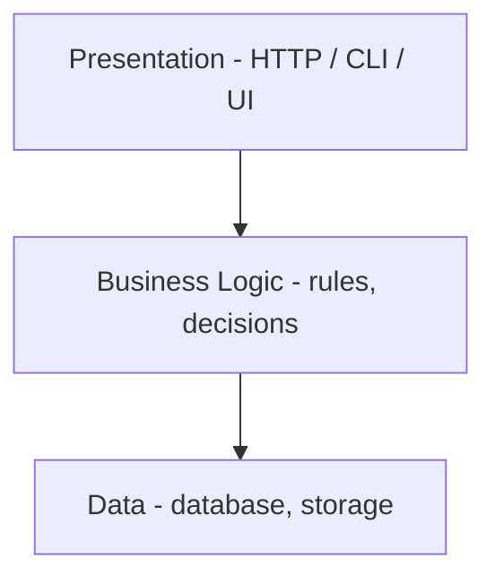

# Separation of Concerns

!!! info "The principle"
    Divide a system into distinct parts, each addressing **one concern**
    (presentation, business logic, data). Each part can be understood, changed,
    tested, and reused **independently**. It is the architectural big brother of
    [Single Responsibility](solid-principles.md).

## Introduction

A **concern** is a distinct aspect of what your software does. Almost every
application has three classic concerns:

1. **Presentation** — how you talk to the outside world (HTTP, CLI, UI)
2. **Business logic** — the actual rules and decisions your app makes
3. **Data** — how you store and retrieve information

---

## The Problem

One function that does everything — HTTP parsing, validation, hashing, SQL, email,
and response building all tangled together:

```python
def register_user(request):
    # 1. Parse the HTTP request (presentation)
    email = request.form["email"]
    password = request.form["password"]

    # 2. Validate (business rule)
    if "@" not in email:
        return {"status": 400, "error": "invalid email"}
    if len(password) < 8:
        return {"status": 400, "error": "password too short"}

    # 3. Hash the password (business rule)
    hashed = hashlib.sha256(password.encode()).hexdigest()

    # 4. Save to database (data)
    conn = sqlite3.connect("users.db")
    conn.execute("INSERT INTO users (email, password) VALUES (?, ?)", (email, hashed))
    conn.commit()

    # 5. Send welcome email (external)
    smtp = smtplib.SMTP("smtp.company.com")
    smtp.sendmail("noreply@co.com", email, "Welcome!")

    # 6. Build the HTTP response (presentation)
    return {"status": 201, "body": "user created"}
```

Three symptoms of tangled concerns:

- **No reuse** — adding a CLI entry point forces you to copy-paste the validation,
  hashing, DB, and email code (a DRY violation). The logic is welded to HTTP.
- **Hard to test** — testing just the validation rules drags in a real database and
  a real SMTP server, even though validation has nothing to do with either.
- **Unsafe to change** — the web team, DBA, and marketing all edit the *same*
  function; any change risks breaking unrelated concerns (SRP's blast radius at the
  system level).

---

## The Fix: Layers

Split the blob into layers, each owning **one concern**.

```python
# ---------- DATA LAYER (how we store) ----------
class UserRepository:
    def save(self, email, hashed_password):
        conn = sqlite3.connect("users.db")
        conn.execute("INSERT INTO users (email, password) VALUES (?, ?)",
                     (email, hashed_password))
        conn.commit()


# ---------- BUSINESS LOGIC LAYER (the rules) ----------
class UserService:
    def __init__(self, repo, mailer):
        self.repo = repo
        self.mailer = mailer

    def register(self, email, password):
        # pure rules — no HTTP, no direct DB/SMTP details
        if "@" not in email:
            raise ValueError("invalid email")
        if len(password) < 8:
            raise ValueError("password too short")

        hashed = hashlib.sha256(password.encode()).hexdigest()
        self.repo.save(email, hashed)
        self.mailer.send(email, "Welcome!")


# ---------- PRESENTATION LAYER (how we talk to the outside) ----------
def register_user_http(request):
    service = UserService(UserRepository(), Mailer())
    try:
        service.register(request.form["email"], request.form["password"])
        return {"status": 201, "body": "user created"}
    except ValueError as e:
        return {"status": 400, "error": str(e)}
```

### The three problems dissolve

**Reuse** — a CLI is just a new presentation layer over the *same* business logic:

```python
def register_user_cli(email, password):
    service = UserService(UserRepository(), Mailer())
    service.register(email, password)          # SAME logic, different entry point
    print("user created")
```

**Testing** — test the rules with fakes, no infrastructure (Dependency Inversion
paying off):

```python
def test_rejects_short_password():
    service = UserService(FakeRepo(), FakeMailer())
    try:
        service.register("a@b.com", "short")
        assert False
    except ValueError as e:
        assert str(e) == "password too short"     # fast, no DB, no SMTP
```

**Change safety** — swap SQLite for Postgres → only `UserRepository` changes.
Change the HTTP response → only `register_user_http` changes. Each concern changes
independently.

---

## The Layered Model



Each layer depends on the one below through **abstractions** (Dependency
Inversion) and knows nothing about the layer above.

---

## How It Connects

- **Single Responsibility (SOLID)** — SoC is SRP scaled up from *classes* to
  *layers/modules*.
- **Dependency Inversion (SOLID)** — layers connect via injected abstractions
  (`repo`, `mailer`), which makes them swappable and testable.
- **DRY** — business logic exists once and is reused by every presentation layer.

## Summary Checklist

- [ ] Are presentation, business logic, and data mixed in one place?
- [ ] Can I add a new entry point (CLI, API) without copying core logic?
- [ ] Can I test business rules without a real database or network?
- [ ] Does each layer change independently of the others?

## Related Topics

- [SOLID Principles (Python)](solid-principles.md)
- [Law of Demeter (Python)](law-of-demeter.md)
- [Composition over Inheritance (Python)](composition-over-inheritance.md)

---

**Tags**: #python #programming #separation-of-concerns #architecture #clean-code

**Difficulty**: <span class="difficulty-intermediate">Intermediate</span>
