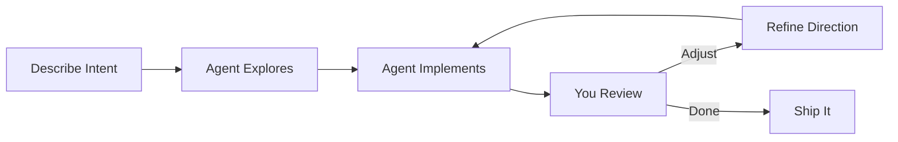

# Vibe Coding with Kiro CLI

!!! info "What is Vibe Coding?"
    Vibe coding is the practice of collaborating with an AI agent in your development workflow — describing intent, iterating on output, and letting the AI handle implementation while you focus on design decisions and verification.

## Introduction

Vibe coding with Kiro CLI is fundamentally different from writing prompts for an API. You're not crafting a single perfect prompt — you're having a **conversation** with an agent that can read your files, run commands, search your codebase, and make changes directly.

The skill isn't "write the perfect prompt." It's **knowing when to be specific, when to be broad, and when to let the agent figure it out.**

### Why This Matters

- **Traditional prompting**: You → Prompt → Model → Output → You evaluate
- **Vibe coding**: You ↔ Agent (reads code, runs tests, iterates, self-corrects)

The agent has tools. It can verify its own work. Your job shifts from "specify everything upfront" to "guide, review, and course-correct."

## The Vibe Coding Workflow



### The Three Modes of Collaboration

| Mode | When to Use | Your Input Style |
|------|-------------|-----------------|
| **Autopilot** | Well-defined tasks, low risk | "Add pagination to /users endpoint" |
| **Copilot** | Medium complexity, some ambiguity | "I need auth — let's discuss approach first" |
| **Navigator** | High risk, architectural decisions | "Walk me through options for X before changing anything" |

## Effective Communication Patterns

### Pattern 1: The Complete Task Brief

Best for well-understood, self-contained tasks.

```text
Add rate limiting to the API gateway.

Context:
- Using Express.js with Redis already available
- Need per-user limits (100 req/min) and global limits (10k req/min)
- Return 429 with Retry-After header when exceeded

Constraints:
- Don't modify existing middleware order
- Add tests using the existing Jest setup
```

!!! tip "Why This Works"
    You've given the agent everything it needs to act autonomously: the task, context, technical constraints, and verification criteria. It can read your code, implement, and test without asking questions.

### Pattern 2: The Exploratory Start

Best when you're unsure of the approach.

```text
The checkout flow is slow — takes 3-4 seconds after clicking "Pay."
Help me figure out where the bottleneck is.
```

The agent will read relevant code, trace the flow, and report findings. You then decide what to fix.

### Pattern 3: The Iterative Refinement

Start broad, narrow down based on what the agent produces.

```text
# Round 1
"Create a CLI tool for managing database migrations"

# Round 2 (after seeing initial output)
"Good structure. Change the storage to use SQLite instead of JSON files,
and add a 'status' command that shows pending vs applied migrations"

# Round 3
"Add dry-run support to the 'up' command — show SQL without executing"
```

### Pattern 4: The Constraint-First Request

When you care more about HOW than WHAT.

```text
Refactor the payment module.

Rules:
- No breaking changes to the public API
- Keep the PR under 200 lines changed
- Must pass existing test suite
- Don't add new dependencies
```

## Kiro CLI-Specific Strategies

### Use `/plan` for Complex Tasks

For multi-step features, start with the planning agent:

```text
/plan Build a notification system with email and in-app channels
```

The planner will:

1. Ask clarifying questions (tech stack, scale, preferences)
2. Research your existing codebase
3. Produce a step-by-step implementation plan
4. Hand off to the execution agent with full context

!!! tip "When to Use /plan"
    - Features touching 3+ files
    - Architectural decisions with tradeoffs
    - Tasks where you're unsure of the approach
    - Anything you'd normally sketch on a whiteboard first

### Leverage Steering Files

Create `.kiro/steering/` files to give the agent persistent project context:

```text
.kiro/steering/
├── product.md      → What the project does, who it's for
├── tech.md         → Stack, dependencies, build commands
└── structure.md    → Directory layout, naming conventions
```

This means you **never have to repeat** project context in your prompts. Instead of:

```text
# ❌ Repeating context every time
"We use FastAPI with SQLAlchemy and PostgreSQL. The project structure
is src/api/ for routes and src/models/ for database models. Add a..."
```

You just say:

```text
# ✅ Agent already knows your stack from steering files
"Add a /reports endpoint that returns monthly sales aggregates"
```

### Index Your Codebase with Knowledge Bases

For large projects, index key directories so the agent can search semantically:

```text
/knowledge add -n "source code" -p ./src
/knowledge add -n "documentation" -p ./docs
```

Then the agent can find relevant code without you pointing to specific files:

```text
"The email sending is failing silently somewhere. Find where we
handle email dispatch and add proper error logging."
```

### Use Subagents for Parallel Work

For independent tasks that don't depend on each other:

```text
"Research the best approach for WebSocket authentication AND
review our current error handling patterns. I need both before
deciding on the real-time notification architecture."
```

Kiro can spawn parallel subagents to handle both simultaneously.

## The Art of Context

### What to Include

| Always Include | Include When Relevant | Skip |
|---------------|----------------------|------|
| The specific task | Error messages / logs | General background the agent can read from files |
| Success criteria | Version constraints | Explanations of how your code works (it can read it) |
| Hard constraints | Performance requirements | Step-by-step instructions (let the agent decide HOW) |

### What NOT to Do

```text
# ❌ Over-specifying implementation details
"Open src/utils/auth.ts, go to line 47, find the validateToken
function, add a try-catch block around the jwt.verify call on
line 52, catch JsonWebTokenError, and return null instead of
throwing..."

# ✅ State the problem, let the agent solve it
"The API crashes when receiving an expired JWT. Make token
validation return null instead of throwing on invalid tokens."
```

```text
# ❌ Too vague
"Fix the bug"

# ✅ Provide the signal
"Users report 500 errors on POST /orders when the cart has 50+ items.
Here's the error from logs: 'PayloadTooLargeError: request entity too large'"
```

## Trust Calibration

### When to Let the Agent Run

- ✅ Adding tests for existing code
- ✅ Refactoring with existing test coverage
- ✅ Creating new files that don't affect existing code
- ✅ Fixing lint/type errors
- ✅ Documentation updates

### When to Review Before Applying

- ⚠️ Database migrations
- ⚠️ Authentication/authorization changes
- ⚠️ Changes to CI/CD pipelines
- ⚠️ Dependency updates
- ⚠️ Configuration changes for production

### When to Discuss First

- 🛑 Architectural decisions that are hard to reverse
- 🛑 Deleting code or data
- 🛑 Changes affecting other teams' interfaces
- 🛑 Security-sensitive modifications

```text
# Good pattern for high-risk changes
"I want to migrate from REST to GraphQL for the user-facing API.
Don't make any changes yet — walk me through the migration strategy,
what breaks, and how we'd do it incrementally."
```

## Common Anti-Patterns

### ❌ The Micromanager

```text
"Read file X. Now read file Y. Now create a function called Z
that takes parameters A and B. Put it on line 45..."
```

**Why it fails**: You're doing the thinking AND the typing (through the agent). Let the agent explore and decide.

**Fix**: Describe the outcome, not the steps.

### ❌ The Context Dump

```text
"Here's my entire application architecture, all 15 services,
the complete database schema, our deployment pipeline, team
structure, and sprint goals. Now fix this CSS bug."
```

**Why it fails**: Irrelevant context dilutes focus and wastes tokens.

**Fix**: Provide only what's relevant to the task at hand.

### ❌ The Assumption Maker

```text
"You know our codebase, just fix the login issue"
```

**Why it fails**: The agent doesn't retain memory between sessions (unless using knowledge bases). It needs to re-read relevant code each time.

**Fix**: Point to the area or describe symptoms so the agent knows where to look.

### ❌ The Never-Reviewer

Blindly accepting all agent output without reading it.

**Why it fails**: AI can introduce subtle bugs, especially in edge cases, concurrency, or security logic.

**Fix**: Always review diffs for critical paths. Trust but verify.

## Prompt Templates for Common Tasks

### Bug Fix

```text
Bug: [what's broken]
Expected: [what should happen]
Actual: [what happens instead]
Reproduce: [steps or trigger]
Logs/Error: [paste relevant output]
```

### New Feature

```text
Feature: [what to build]
User story: [who benefits and how]
Acceptance criteria:
- [criterion 1]
- [criterion 2]
Constraints: [technical limitations]
```

### Refactor

```text
Refactor: [what area]
Goal: [why — performance? readability? extensibility?]
Rules:
- No behavior changes (existing tests must pass)
- [additional constraints]
```

### Code Review Request

```text
Review my changes in [file/branch].
Focus on: [security | performance | correctness | all]
Context: [what the change does and why]
```

## Learning Path

### Beginner

- [ ] Learn basic Kiro CLI commands (`/help`, `/plan`, `/guide`)
- [ ] Practice the "complete task brief" pattern
- [ ] Set up steering files for your project
- [ ] Use the agent for simple, low-risk tasks (tests, docs, formatting)

### Intermediate

- [ ] Master iterative refinement — start broad, narrow down
- [ ] Use `/plan` for multi-file features
- [ ] Index your codebase with knowledge bases
- [ ] Calibrate trust — know when to review vs. let it run
- [ ] Learn to provide just enough context (not too much, not too little)

### Advanced

- [ ] Design steering files that make every prompt more effective
- [ ] Use subagents for parallel research and implementation
- [ ] Build prompt templates for your team's common workflows
- [ ] Combine planning → implementation → review in fluid sessions
- [ ] Teach teammates effective vibe coding patterns

## Key Takeaways

!!! success "The Vibe Coding Mindset"
    1. **Describe outcomes, not steps** — let the agent figure out HOW
    2. **Provide context through structure** — steering files > repeating yourself
    3. **Iterate, don't perfect** — a good-enough first prompt + refinement beats agonizing over the perfect prompt
    4. **Trust calibrated to risk** — autopilot for safe changes, navigator for dangerous ones
    5. **Review what matters** — always check security, data, and architecture decisions

## Related Topics

- [Prompt Engineering Fundamentals](index.md) — Core techniques and theory
- [Docker](../docker/index.md) — Containerize AI-powered applications
- [Terraform](../terraform/index.md) — Infrastructure as code

---

**Tags**: #vibe-coding #kiro-cli #prompt-engineering #ai-development #best-practices

**Difficulty**: <span class="difficulty-intermediate">Intermediate</span>
