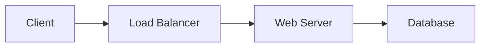

# Content Templates Guide

This directory contains standardized templates for creating consistent documentation across the TechMaster Learning Notes platform.

## Available Templates

### 1. AWS Service Template (`aws-service-template.md`)

Use this template for documenting AWS services.

**When to use**: Creating documentation for any AWS service (EC2, S3, Lambda, etc.)

**Key sections**:
- Service overview and key features
- Use cases and architecture patterns
- Configuration examples
- Best practices (performance, security, cost)
- Pricing and limits
- Integration with other services
- Monitoring and troubleshooting
- Exam tips for certifications

### 2. Certification Template (`certification-template.md`)

Use this template for AWS certification study guides.

**When to use**: Creating study materials for AWS certification exams

**Key sections**:
- Exam overview and format
- Exam domains with key topics
- Practice questions with explanations
- Study plan and timeline
- Key concepts and service comparisons
- Exam tips and strategies
- Hands-on labs
- Practice resources and cheat sheets

### 3. Technology Template (`technology-template.md`)

Use this template for non-AWS technologies (Docker, Kubernetes, Terraform, etc.)

**When to use**: Documenting other technologies and tools

**Key sections**:
- Technology introduction and core concepts
- Architecture overview
- Installation and configuration
- Key features and use cases
- Best practices
- Advanced topics and patterns
- Troubleshooting
- Integration examples
- Learning path and exercises

## Metadata Structure

All templates include YAML front matter with standardized metadata:

```yaml
---
title: "Page Title"
description: "SEO-friendly description"
tags:
  - tag1
  - tag2
  - tag3
certification:  # Optional, for AWS content
  - solutions-architect
  - developer
  - sysops
difficulty: beginner|intermediate|advanced
last_updated: "YYYY-MM-DD"
---
```

### Metadata Fields

#### Required Fields

- **title**: Page title (used in navigation and SEO)
- **description**: Brief description for search engines and previews
- **tags**: Array of relevant tags for categorization
- **difficulty**: Content difficulty level
- **last_updated**: Date of last update (YYYY-MM-DD format)

#### Optional Fields

- **certification**: Array of relevant AWS certifications
- **exam_code**: For certification pages (e.g., "CLF-C02")

### Tag Guidelines

#### AWS Service Tags
```yaml
tags:
  - aws
  - [category]  # compute, storage, networking, databases, security, management
  - [service-name]  # ec2, s3, lambda, etc.
```

#### Certification Tags
```yaml
tags:
  - aws
  - certification
  - [cert-level]  # foundational, associate, professional, specialty
  - [cert-name]  # cloud-practitioner, solutions-architect, etc.
```

#### Technology Tags
```yaml
tags:
  - [technology]  # docker, kubernetes, terraform, etc.
  - [category]  # containers, orchestration, iac, etc.
  - [subcategory]  # optional additional categorization
```

### Difficulty Levels

- **beginner**: Introductory content, no prior knowledge required
- **intermediate**: Requires basic understanding of the topic
- **advanced**: Deep technical content, assumes significant experience

## Using the Templates

### Step 1: Copy the Template

Copy the appropriate template file to your target location:

```bash
# Example: Creating an EC2 documentation page
cp docs/templates/aws-service-template.md docs/aws/compute/ec2.md
```

### Step 2: Update Metadata

Replace all placeholder values in the YAML front matter:

```yaml
---
title: "Amazon EC2 - AWS Service Documentation"
description: "Comprehensive guide to Amazon EC2 including features, use cases, and best practices"
tags: 
  - aws
  - compute
  - ec2
certification:
  - solutions-architect
  - developer
  - sysops
difficulty: intermediate
last_updated: "2024-01-21"
---
```

### Step 3: Fill in Content

Replace all bracketed placeholders `[...]` with actual content:

- `[Service Name]` → `Amazon EC2`
- `[Category]` → `Compute`
- `[Description]` → Actual description

### Step 4: Customize Sections

- Remove sections that don't apply
- Add additional sections as needed
- Adjust examples to match the specific topic

### Step 5: Add to Navigation

Update `mkdocs.yml` to include the new page in the navigation structure.

## Content Guidelines

### Writing Style

- Use clear, concise language
- Write in present tense
- Use active voice
- Include practical examples
- Provide code snippets where applicable

### Code Examples

- Use appropriate syntax highlighting
- Include comments for clarity
- Show realistic, working examples
- Provide multiple language examples when relevant

### Admonitions

Use Material for MkDocs admonitions for callouts:

```markdown
!!! info "Information"
    General information or context

!!! tip "Best Practice"
    Recommendations and tips

!!! warning "Important"
    Warnings and cautions

!!! danger "Critical"
    Critical warnings

!!! success "Success"
    Positive outcomes or confirmations

!!! failure "Error"
    Error conditions or problems

!!! question "Question"
    Practice questions or prompts

!!! example "Example"
    Example scenarios or use cases
```

### Diagrams

Use Mermaid for architecture diagrams:

```markdown

```

### Tables

Use markdown tables for comparisons and structured data:

```markdown
| Feature | Option A | Option B |
|---------|----------|----------|
| Cost | Low | High |
| Performance | Medium | High |
```

## Styling Classes

### Difficulty Indicators

```html
<span class="difficulty-beginner">Beginner</span>
<span class="difficulty-intermediate">Intermediate</span>
<span class="difficulty-advanced">Advanced</span>
```

### Certification Badges

```html
<span class="cert-badge">Cloud Practitioner</span>
<span class="cert-badge">Solutions Architect</span>
<span class="cert-badge">Developer</span>
<span class="cert-badge">SysOps</span>
```

### Content Boxes

```html
<div class="content-box">
Custom content with styled border and background
</div>
```

## Quality Checklist

Before publishing, ensure:

- [ ] All metadata fields are filled correctly
- [ ] All placeholder text is replaced
- [ ] Code examples are tested and working
- [ ] Links are valid and point to correct locations
- [ ] Diagrams render correctly
- [ ] Tags are appropriate and consistent
- [ ] Difficulty level is accurate
- [ ] Last updated date is current
- [ ] Content follows style guidelines
- [ ] Page is added to navigation in mkdocs.yml

## Examples

See the following pages for examples of properly formatted content:

- AWS Service: `docs/aws/compute/index.md`
- Certification: `docs/certifications/aws-cloud-practitioner/index.md`
- Technology: `docs/other-technologies/docker/index.md`

## Support

For questions or suggestions about templates, please refer to the main documentation or open an issue in the repository.
