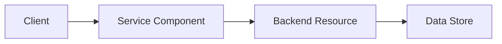

# [Service Name]

!!! info "Service Overview"
    Brief description of what this AWS service does and its primary use cases.

## Overview

Detailed introduction to the service, explaining its purpose and how it fits into the AWS ecosystem.

## Key Features

- **Feature 1**: Description of the feature and its benefits
- **Feature 2**: Description of the feature and its benefits
- **Feature 3**: Description of the feature and its benefits
- **Feature 4**: Description of the feature and its benefits

## Use Cases

### Use Case 1: [Name]
Description of when and why you would use this service for this particular scenario.

### Use Case 2: [Name]
Description of another common use case for this service.

### Use Case 3: [Name]
Description of an advanced or specialized use case.

## Architecture Patterns



## Configuration

### Basic Setup

```bash
# Example AWS CLI command for basic setup
aws [service] create-[resource] \
    --name my-resource \
    --region us-east-1 \
    --tags Key=Environment,Value=Production
```

### Advanced Configuration

```yaml
# Example CloudFormation/Terraform configuration
Resources:
  MyResource:
    Type: AWS::[Service]::[ResourceType]
    Properties:
      Name: my-resource
      Configuration:
        Setting1: value1
        Setting2: value2
```

## Best Practices

!!! tip "Performance"
    - Best practice for optimizing performance
    - Another performance consideration

!!! warning "Security"
    - Security best practice
    - Another security consideration

!!! success "Cost Optimization"
    - Cost optimization tip
    - Another cost-saving strategy

## Common Patterns

### Pattern 1: [Pattern Name]

Description of the pattern and when to use it.

```python
# Example code implementation
import boto3

client = boto3.client('[service]')
response = client.operation(
    Parameter1='value1',
    Parameter2='value2'
)
```

### Pattern 2: [Pattern Name]

Description of another common pattern.

## Pricing

| Component | Pricing Model | Typical Cost |
|-----------|---------------|--------------|
| Component 1 | Per unit | $X per unit |
| Component 2 | Per hour | $Y per hour |
| Data Transfer | Per GB | $Z per GB |

!!! note "Free Tier"
    Information about AWS Free Tier availability for this service.

## Limits and Quotas

| Resource | Default Limit | Adjustable |
|----------|---------------|------------|
| Resource 1 | X per region | Yes |
| Resource 2 | Y per account | No |
| Resource 3 | Z per service | Yes |

## Integration with Other Services

- **Service 1**: How this service integrates with another AWS service
- **Service 2**: Another integration point
- **Service 3**: Additional integration capabilities

## Monitoring and Troubleshooting

### CloudWatch Metrics

Key metrics to monitor:

- **Metric 1**: What it measures and why it matters
- **Metric 2**: Another important metric
- **Metric 3**: Additional monitoring point

### Common Issues

!!! failure "Issue 1: [Problem Description]"
    **Symptoms**: What you'll see when this issue occurs
    
    **Solution**: How to resolve the issue

!!! failure "Issue 2: [Problem Description]"
    **Symptoms**: What you'll see when this issue occurs
    
    **Solution**: How to resolve the issue

## Exam Tips

!!! example "For AWS Certifications"
    - Key point to remember for certification exams
    - Another important exam concept
    - Common exam scenario involving this service
    - Comparison with similar services

## Additional Resources

- [Official AWS Documentation](https://docs.aws.amazon.com/[service]/)
- [AWS Service FAQs](https://aws.amazon.com/[service]/faqs/)
- [AWS Whitepapers](https://aws.amazon.com/whitepapers/)

## Related Topics

- [Related Service 1](../[category]/[service].md)
- [Related Service 2](../[category]/[service].md)
- [Related Certification Guide](../../certifications/[cert]/index.md)

---

**Tags**: #aws #[category] #[service-name]

**Difficulty**: <span class="difficulty-beginner">Beginner</span> | <span class="difficulty-intermediate">Intermediate</span> | <span class="difficulty-advanced">Advanced</span>

**Relevant Certifications**: 
<span class="cert-badge">Cloud Practitioner</span>
<span class="cert-badge">Solutions Architect</span>
<span class="cert-badge">Developer</span>
<span class="cert-badge">SysOps</span>
