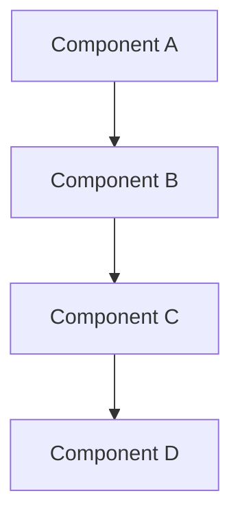

# AWS [Certification Name]

!!! info "Certification Overview"
    **Exam Code**: [EXAM-CODE]  
    **Duration**: XXX minutes  
    **Number of Questions**: XX-XX questions  
    **Passing Score**: XXX/1000  
    **Cost**: $XXX USD  
    **Validity**: 3 years

## Exam Overview

Brief description of the certification, its target audience, and what it validates.

### Prerequisites

- Recommended experience level
- Suggested prior certifications (if any)
- Technical knowledge requirements

### Exam Format

- **Question Types**: Multiple choice, multiple response
- **Delivery Method**: Pearson VUE testing center or online proctored
- **Languages**: Available languages for the exam

## Exam Domains

### Domain 1: [Domain Name] (XX%)

#### Key Topics

- **Topic 1.1**: [Topic Name]
    - Subtopic details
    - Key concepts to understand
    - Common scenarios

- **Topic 1.2**: [Topic Name]
    - Subtopic details
    - Key concepts to understand
    - Common scenarios

- **Topic 1.3**: [Topic Name]
    - Subtopic details
    - Key concepts to understand
    - Common scenarios

#### Services to Know

| Service | Key Features | Exam Focus |
|---------|--------------|------------|
| Service 1 | Features | What to know |
| Service 2 | Features | What to know |
| Service 3 | Features | What to know |

#### Practice Questions

!!! question "Sample Question 1"
    A company needs to [scenario description]. Which AWS service should they use?
    
    A) Option A  
    B) Option B  
    C) Option C  
    D) Option D
    
    ??? success "Answer"
        **Correct Answer**: C
        
        **Explanation**: Detailed explanation of why this is correct and why other options are incorrect.

### Domain 2: [Domain Name] (XX%)

#### Key Topics

- **Topic 2.1**: [Topic Name]
    - Subtopic details
    - Key concepts to understand
    - Common scenarios

- **Topic 2.2**: [Topic Name]
    - Subtopic details
    - Key concepts to understand
    - Common scenarios

- **Topic 2.3**: [Topic Name]
    - Subtopic details
    - Key concepts to understand
    - Common scenarios

#### Services to Know

| Service | Key Features | Exam Focus |
|---------|--------------|------------|
| Service 1 | Features | What to know |
| Service 2 | Features | What to know |
| Service 3 | Features | What to know |

#### Practice Questions

!!! question "Sample Question 1"
    [Question text]
    
    A) Option A  
    B) Option B  
    C) Option C  
    D) Option D
    
    ??? success "Answer"
        **Correct Answer**: [Letter]
        
        **Explanation**: [Explanation]

### Domain 3: [Domain Name] (XX%)

#### Key Topics

- **Topic 3.1**: [Topic Name]
- **Topic 3.2**: [Topic Name]
- **Topic 3.3**: [Topic Name]

#### Services to Know

| Service | Key Features | Exam Focus |
|---------|--------------|------------|
| Service 1 | Features | What to know |
| Service 2 | Features | What to know |

### Domain 4: [Domain Name] (XX%)

#### Key Topics

- **Topic 4.1**: [Topic Name]
- **Topic 4.2**: [Topic Name]
- **Topic 4.3**: [Topic Name]

#### Services to Know

| Service | Key Features | Exam Focus |
|---------|--------------|------------|
| Service 1 | Features | What to know |
| Service 2 | Features | What to know |

## Study Plan

### Week 1-2: Foundation

- [ ] Review Domain 1 topics
- [ ] Complete hands-on labs for core services
- [ ] Watch video tutorials
- [ ] Read AWS documentation

### Week 3-4: Deep Dive

- [ ] Review Domain 2 and 3 topics
- [ ] Practice with sample questions
- [ ] Build practice projects
- [ ] Review whitepapers

### Week 5-6: Advanced Topics

- [ ] Review Domain 4 topics
- [ ] Complete practice exams
- [ ] Review weak areas
- [ ] Final preparation

## Key Concepts

### Concept 1: [Name]

Detailed explanation of an important concept for this certification.

### Concept 2: [Name]

Another important concept with examples.

### Concept 3: [Name]

Additional key concept to master.

## Common Exam Scenarios

### Scenario 1: [Scenario Type]

!!! example "Typical Question Pattern"
    When you see questions about [topic], remember:
    
    - Key point 1
    - Key point 2
    - Key point 3

### Scenario 2: [Scenario Type]

!!! example "Typical Question Pattern"
    For questions involving [topic]:
    
    - Key consideration 1
    - Key consideration 2
    - Key consideration 3

## Service Comparisons

### Comparison 1: Service A vs Service B

| Feature | Service A | Service B | When to Use |
|---------|-----------|-----------|-------------|
| Feature 1 | Details | Details | Use case |
| Feature 2 | Details | Details | Use case |
| Feature 3 | Details | Details | Use case |

### Comparison 2: Service C vs Service D

| Feature | Service C | Service D | When to Use |
|---------|-----------|-----------|-------------|
| Feature 1 | Details | Details | Use case |
| Feature 2 | Details | Details | Use case |

## Exam Tips and Strategies

!!! tip "Before the Exam"
    - Get a good night's sleep
    - Arrive early or test your online setup
    - Review key concepts one last time
    - Stay calm and confident

!!! tip "During the Exam"
    - Read questions carefully
    - Eliminate obviously wrong answers
    - Flag difficult questions for review
    - Manage your time effectively
    - Don't overthink questions

!!! tip "Common Traps"
    - Watch for "most cost-effective" vs "most performant"
    - Pay attention to "least operational overhead"
    - Consider security best practices
    - Think about scalability requirements

## Hands-On Labs

### Lab 1: [Lab Name]

**Objective**: What you'll learn

**Steps**:
1. Step 1 description
2. Step 2 description
3. Step 3 description

**Expected Outcome**: What you should achieve

### Lab 2: [Lab Name]

**Objective**: What you'll learn

**Steps**:
1. Step 1 description
2. Step 2 description
3. Step 3 description

## Practice Resources

### Official AWS Resources

- [Exam Guide](https://aws.amazon.com/certification/)
- [Sample Questions](https://aws.amazon.com/certification/sample-questions/)
- [AWS Training](https://aws.amazon.com/training/)
- [AWS Whitepapers](https://aws.amazon.com/whitepapers/)

### Third-Party Resources

- Practice exam platforms
- Video courses
- Study groups
- Community forums

## Cheat Sheet

### Must-Know Services

| Service | Purpose | Key Features |
|---------|---------|--------------|
| Service 1 | Purpose | Features |
| Service 2 | Purpose | Features |
| Service 3 | Purpose | Features |

### Important Limits

| Resource | Limit | Notes |
|----------|-------|-------|
| Resource 1 | X | Important note |
| Resource 2 | Y | Important note |

### Common Ports and Protocols

| Protocol | Port | Use Case |
|----------|------|----------|
| HTTP | 80 | Web traffic |
| HTTPS | 443 | Secure web |
| SSH | 22 | Remote access |

## Related Certifications

- **Previous**: [Lower level certification]
- **Next**: [Higher level certification]
- **Parallel**: [Same level, different track]

## Additional Resources

- [AWS Documentation](https://docs.aws.amazon.com/)
- [AWS Architecture Center](https://aws.amazon.com/architecture/)
- [AWS Well-Architected Framework](https://aws.amazon.com/architecture/well-architected/)

---

**Tags**: #aws #certification #[cert-level] #[cert-name]

**Difficulty**: Intermediate

**Exam Level**: [Certification Level]
