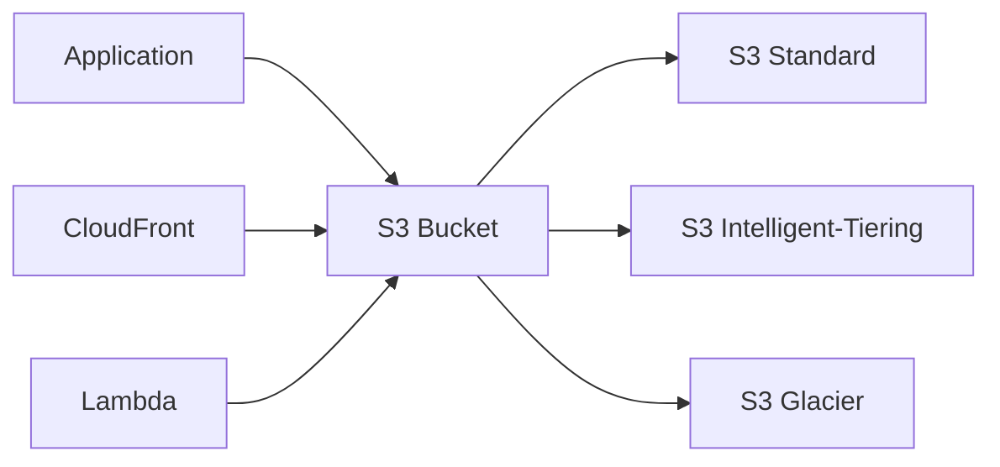

# Amazon S3 (Simple Storage Service)

!!! info "Service Overview"
    Amazon S3 is an object storage service offering industry-leading scalability, data availability, security, and performance. It's designed to store and retrieve any amount of data from anywhere on the web.

## Overview

Amazon Simple Storage Service (S3) is a foundational AWS service that provides object storage through a web service interface. S3 is designed for 99.999999999% (11 9's) durability and stores data for millions of applications used by market leaders in every industry.

S3 is ideal for a wide range of use cases including backup and restore, disaster recovery, data archiving, data lakes and big data analytics, hybrid cloud storage, and cloud-native application data.

## Key Features

- **Scalability**: Store unlimited amounts of data with no capacity planning required
- **Durability**: 99.999999999% (11 9's) durability through automatic replication across multiple facilities
- **Availability**: 99.99% availability SLA with multiple storage classes for different access patterns
- **Security**: Comprehensive security and compliance capabilities including encryption, access control, and audit logging

## Use Cases

### Use Case 1: Backup and Disaster Recovery
S3 provides a reliable and cost-effective solution for backing up critical data. With cross-region replication and versioning, you can protect against accidental deletion and regional failures.

### Use Case 2: Data Lake and Big Data Analytics
S3 serves as the foundation for data lakes, allowing you to store structured and unstructured data at any scale. Integration with analytics services like Athena, EMR, and Redshift enables powerful data analysis.

### Use Case 3: Static Website Hosting
Host static websites directly from S3 buckets with high availability and scalability. Perfect for single-page applications, documentation sites, and content distribution.

## Architecture Patterns



## Configuration

### Basic Setup

```bash
# Create an S3 bucket
aws s3 mb s3://my-unique-bucket-name --region us-east-1

# Upload a file
aws s3 cp myfile.txt s3://my-unique-bucket-name/

# List bucket contents
aws s3 ls s3://my-unique-bucket-name/

# Download a file
aws s3 cp s3://my-unique-bucket-name/myfile.txt ./downloaded-file.txt
```

### Advanced Configuration

```yaml
# CloudFormation template for S3 bucket with versioning and encryption
Resources:
  MyS3Bucket:
    Type: AWS::S3::Bucket
    Properties:
      BucketName: my-secure-bucket
      VersioningConfiguration:
        Status: Enabled
      BucketEncryption:
        ServerSideEncryptionConfiguration:
          - ServerSideEncryptionByDefault:
              SSEAlgorithm: AES256
      PublicAccessBlockConfiguration:
        BlockPublicAcls: true
        BlockPublicPolicy: true
        IgnorePublicAcls: true
        RestrictPublicBuckets: true
      LifecycleConfiguration:
        Rules:
          - Id: TransitionToIA
            Status: Enabled
            Transitions:
              - TransitionInDays: 30
                StorageClass: STANDARD_IA
          - Id: TransitionToGlacier
            Status: Enabled
            Transitions:
              - TransitionInDays: 90
                StorageClass: GLACIER
```

## Best Practices

!!! tip "Performance"
    - Use multipart upload for files larger than 100 MB
    - Implement request rate optimization with key naming strategies
    - Use CloudFront for frequently accessed content
    - Enable Transfer Acceleration for long-distance transfers

!!! warning "Security"
    - Enable bucket versioning to protect against accidental deletion
    - Use bucket policies and IAM policies for access control
    - Enable server-side encryption for data at rest
    - Block public access unless explicitly required
    - Enable MFA Delete for critical buckets
    - Use VPC endpoints for private access

!!! success "Cost Optimization"
    - Use S3 Intelligent-Tiering for unpredictable access patterns
    - Implement lifecycle policies to transition data to cheaper storage classes
    - Delete incomplete multipart uploads
    - Use S3 Storage Lens to analyze storage usage
    - Consider S3 Glacier for long-term archival

## Common Patterns

### Pattern 1: Secure File Upload with Pre-signed URLs

Pre-signed URLs allow temporary access to S3 objects without requiring AWS credentials.

```python
import boto3
from botocore.exceptions import ClientError

def create_presigned_url(bucket_name, object_name, expiration=3600):
    """Generate a presigned URL to share an S3 object"""
    s3_client = boto3.client('s3')
    try:
        response = s3_client.generate_presigned_url(
            'get_object',
            Params={'Bucket': bucket_name, 'Key': object_name},
            ExpiresIn=expiration
        )
    except ClientError as e:
        print(f"Error: {e}")
        return None
    return response

# Usage
url = create_presigned_url('my-bucket', 'myfile.txt', 3600)
print(f"Presigned URL: {url}")
```

### Pattern 2: Event-Driven Processing with Lambda

Automatically process files uploaded to S3 using Lambda functions.

```python
import json
import boto3

s3_client = boto3.client('s3')

def lambda_handler(event, context):
    """Process S3 upload events"""
    for record in event['Records']:
        bucket = record['s3']['bucket']['name']
        key = record['s3']['object']['key']
        
        print(f"Processing file: {key} from bucket: {bucket}")
        
        # Get the object
        response = s3_client.get_object(Bucket=bucket, Key=key)
        content = response['Body'].read()
        
        # Process the content
        # ... your processing logic here ...
        
        return {
            'statusCode': 200,
            'body': json.dumps('Processing complete')
        }
```

## Pricing

| Component | Pricing Model | Typical Cost |
|-----------|---------------|--------------|
| S3 Standard Storage | Per GB/month | $0.023 per GB (first 50 TB) |
| S3 Intelligent-Tiering | Per GB/month | $0.023 per GB + monitoring fee |
| S3 Standard-IA | Per GB/month | $0.0125 per GB |
| S3 Glacier Flexible Retrieval | Per GB/month | $0.0036 per GB |
| PUT/POST Requests | Per 1,000 requests | $0.005 |
| GET Requests | Per 1,000 requests | $0.0004 |
| Data Transfer Out | Per GB | $0.09 per GB (first 10 TB) |

!!! note "Free Tier"
    AWS Free Tier includes 5 GB of S3 Standard storage, 20,000 GET requests, 2,000 PUT requests, and 100 GB of data transfer out per month for the first 12 months.

## Limits and Quotas

| Resource | Default Limit | Adjustable |
|----------|---------------|------------|
| Buckets per account | 100 | Yes (up to 1,000) |
| Object size | 5 TB max | No |
| Single PUT size | 5 GB max | No |
| Multipart upload parts | 10,000 max | No |
| Bucket policy size | 20 KB | No |

## Integration with Other Services

- **CloudFront**: Content delivery network for S3-hosted content with edge caching
- **Lambda**: Event-driven processing triggered by S3 events
- **Athena**: Query data directly in S3 using SQL
- **EMR**: Big data processing of S3-stored datasets
- **Glacier**: Automatic archival through lifecycle policies
- **CloudWatch**: Monitoring and metrics for bucket operations
- **CloudTrail**: Audit logging for S3 API calls
- **IAM**: Access control and permissions management

## Monitoring and Troubleshooting

### CloudWatch Metrics

Key metrics to monitor:

- **BucketSizeBytes**: Total size of objects in the bucket
- **NumberOfObjects**: Count of objects in the bucket
- **AllRequests**: Total number of HTTP requests
- **4xxErrors**: Client-side errors (permissions, missing objects)
- **5xxErrors**: Server-side errors
- **FirstByteLatency**: Time to receive the first byte
- **TotalRequestLatency**: Total time for request completion

### Common Issues

!!! failure "Issue 1: Access Denied (403 Forbidden)"
    **Symptoms**: Unable to access S3 objects, receiving 403 errors
    
    **Solution**: 
    1. Check IAM policy permissions for the user/role
    2. Verify bucket policy allows the action
    3. Ensure public access settings if accessing without credentials
    4. Check for explicit DENY statements in policies
    5. Verify object ACLs if using ACL-based permissions

!!! failure "Issue 2: Slow Upload/Download Performance"
    **Symptoms**: Transfers taking longer than expected
    
    **Solution**:
    1. Use multipart upload for large files
    2. Enable Transfer Acceleration for long-distance transfers
    3. Increase parallelism in your application
    4. Check network bandwidth and latency
    5. Consider using CloudFront for downloads

## Exam Tips

!!! example "For AWS Certifications"
    - **S3 is object storage, not block storage** - Cannot mount as a file system
    - **Bucket names are globally unique** - Must be unique across all AWS accounts
    - **Eventual consistency for overwrite PUTS and DELETES** - Updates may take time to propagate
    - **Strong read-after-write consistency for new PUTS** - New objects are immediately readable
    - **Storage classes comparison** - Know when to use Standard, IA, Intelligent-Tiering, Glacier
    - **Versioning cannot be disabled** - Only suspended after enabling
    - **MFA Delete** - Requires MFA for object deletion when enabled
    - **Cross-region replication** - Requires versioning on both source and destination
    - **S3 Transfer Acceleration** - Uses CloudFront edge locations for faster uploads
    - **Lifecycle policies** - Automate transitions between storage classes

## Additional Resources

- [Official AWS S3 Documentation](https://docs.aws.amazon.com/s3/)
- [AWS S3 FAQs](https://aws.amazon.com/s3/faqs/)
- [S3 Best Practices Guide](https://docs.aws.amazon.com/AmazonS3/latest/userguide/best-practices.html)
- [S3 Security Best Practices](https://docs.aws.amazon.com/AmazonS3/latest/userguide/security-best-practices.html)

## Related Topics

- [Amazon CloudFront](../networking/cloudfront.md)
- [AWS Lambda](../compute/lambda.md)
- [Amazon Athena](../analytics/athena.md)
- [Solutions Architect Certification](../../certifications/aws-solutions-architect/index.md)

---

**Tags**: #aws #storage #s3 #object-storage #cloud-storage

**Difficulty**: <span class="difficulty-intermediate">Intermediate</span>

**Relevant Certifications**: 
<span class="cert-badge">Cloud Practitioner</span>
<span class="cert-badge">Solutions Architect</span>
<span class="cert-badge">Developer</span>
<span class="cert-badge">SysOps</span>
