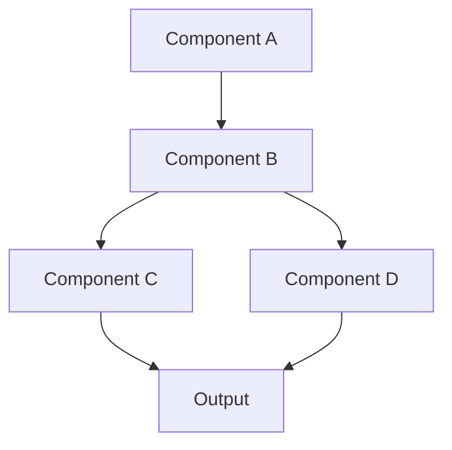

# [Technology Name]

!!! info "Technology Overview"
    Brief description of what this technology is and why it's important to learn.

## Introduction

Detailed introduction to the technology, its history, and its place in modern development.

### Why Learn [Technology Name]?

- **Reason 1**: Benefit or use case
- **Reason 2**: Another compelling reason
- **Reason 3**: Career or technical advantage
- **Reason 4**: Industry adoption or trends

## Core Concepts

### Concept 1: [Name]

Explanation of the first fundamental concept.

```bash
# Example command or code
command --option value
```

### Concept 2: [Name]

Explanation of another core concept.

```yaml
# Example configuration
configuration:
  setting1: value1
  setting2: value2
```

### Concept 3: [Name]

Additional fundamental concept to understand.

## Architecture Overview



## Getting Started

### Installation

#### Prerequisites

- Prerequisite 1
- Prerequisite 2
- Prerequisite 3

#### Installation Steps

=== "Linux"

    ```bash
    # Installation commands for Linux
    sudo apt-get update
    sudo apt-get install [package]
    ```

=== "macOS"

    ```bash
    # Installation commands for macOS
    brew install [package]
    ```

=== "Windows"

    ```powershell
    # Installation commands for Windows
    choco install [package]
    ```

### Basic Configuration

```yaml
# Basic configuration file
version: '1.0'
settings:
  option1: value1
  option2: value2
```

## Key Features

### Feature 1: [Name]

**Description**: What this feature does

**Use Case**: When to use it

**Example**:

```python
# Example code demonstrating the feature
def example_function():
    # Implementation
    pass
```

### Feature 2: [Name]

**Description**: What this feature does

**Use Case**: When to use it

**Example**:

```javascript
// Example code demonstrating the feature
function exampleFunction() {
    // Implementation
}
```

### Feature 3: [Name]

**Description**: What this feature does

**Use Case**: When to use it

## Common Use Cases

### Use Case 1: [Scenario Name]

**Problem**: Description of the problem this solves

**Solution**: How the technology addresses it

**Implementation**:

```bash
# Commands or code for implementation
step1 command
step2 command
```

### Use Case 2: [Scenario Name]

**Problem**: Another common scenario

**Solution**: How to approach it

**Implementation**:

```yaml
# Configuration example
resource:
  type: example
  properties:
    key: value
```

## Best Practices

!!! tip "Performance"
    - Performance optimization tip 1
    - Performance optimization tip 2
    - Performance optimization tip 3

!!! warning "Security"
    - Security best practice 1
    - Security best practice 2
    - Security best practice 3

!!! success "Maintainability"
    - Code organization tip 1
    - Code organization tip 2
    - Code organization tip 3

## Advanced Topics

### Topic 1: [Advanced Feature]

Explanation of an advanced feature or pattern.

```python
# Advanced example
class AdvancedExample:
    def __init__(self):
        self.config = {}
    
    def advanced_method(self):
        # Implementation
        pass
```

### Topic 2: [Advanced Pattern]

Another advanced topic with practical examples.

### Topic 3: [Optimization]

Performance or optimization techniques.

## Common Patterns

### Pattern 1: [Pattern Name]

**When to Use**: Scenario description

**Implementation**:

```javascript
// Pattern implementation
const pattern = {
    method1: function() {
        // Implementation
    },
    method2: function() {
        // Implementation
    }
};
```

### Pattern 2: [Pattern Name]

**When to Use**: Another common pattern

**Implementation**:

```python
# Pattern implementation
def pattern_function():
    # Implementation
    pass
```

## Troubleshooting

### Common Issue 1: [Problem]

!!! failure "Symptoms"
    - What you'll see
    - Error messages
    - Unexpected behavior

!!! success "Solution"
    1. Step to diagnose
    2. Step to fix
    3. Verification step

### Common Issue 2: [Problem]

!!! failure "Symptoms"
    - Issue indicators
    - Error patterns

!!! success "Solution"
    1. Troubleshooting steps
    2. Resolution approach
    3. Prevention tips

## Integration Examples

### Integration with [Tool/Service 1]

How to integrate with another tool or service.

```yaml
# Integration configuration
integration:
  service: example
  settings:
    key: value
```

### Integration with [Tool/Service 2]

Another integration example.

## Comparison with Alternatives

| Feature | [Technology] | Alternative 1 | Alternative 2 |
|---------|--------------|---------------|---------------|
| Feature 1 | Details | Details | Details |
| Feature 2 | Details | Details | Details |
| Feature 3 | Details | Details | Details |
| Use Case | When to use | When to use | When to use |

## Learning Path

### Beginner Level

- [ ] Understand core concepts
- [ ] Complete basic tutorials
- [ ] Build simple projects
- [ ] Practice fundamental commands

### Intermediate Level

- [ ] Explore advanced features
- [ ] Implement common patterns
- [ ] Optimize configurations
- [ ] Integrate with other tools

### Advanced Level

- [ ] Master complex scenarios
- [ ] Contribute to community
- [ ] Build production systems
- [ ] Teach others

## Hands-On Exercises

### Exercise 1: [Exercise Name]

**Objective**: What you'll learn

**Steps**:
1. Step 1 with code example
2. Step 2 with code example
3. Step 3 with code example

**Expected Result**: What you should achieve

### Exercise 2: [Exercise Name]

**Objective**: Another learning goal

**Steps**:
1. Implementation step
2. Configuration step
3. Testing step

## Resources

### Official Documentation

- [Official Docs](https://example.com/docs)
- [API Reference](https://example.com/api)
- [Tutorials](https://example.com/tutorials)

### Community Resources

- GitHub repositories
- Community forums
- Video tutorials
- Blog posts

### Books and Courses

- Recommended books
- Online courses
- Video series

## Related Topics

- [Related Technology 1](../[category]/[tech].md)
- [Related Technology 2](../[category]/[tech].md)
- [AWS Integration](../../aws/[service]/index.md)

---

**Tags**: #[technology] #[category] #[subcategory]

**Difficulty**: <span class="difficulty-beginner">Beginner</span> | <span class="difficulty-intermediate">Intermediate</span> | <span class="difficulty-advanced">Advanced</span>
