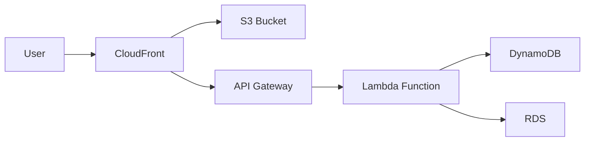
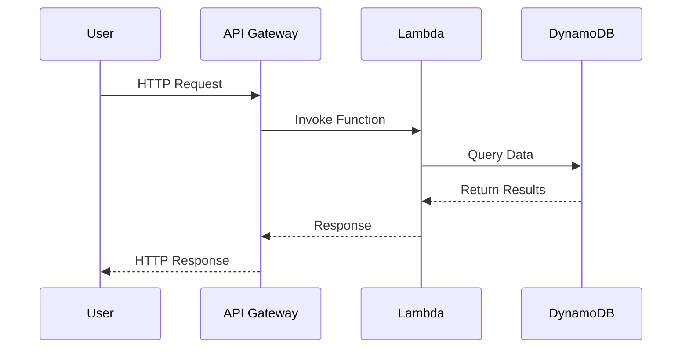
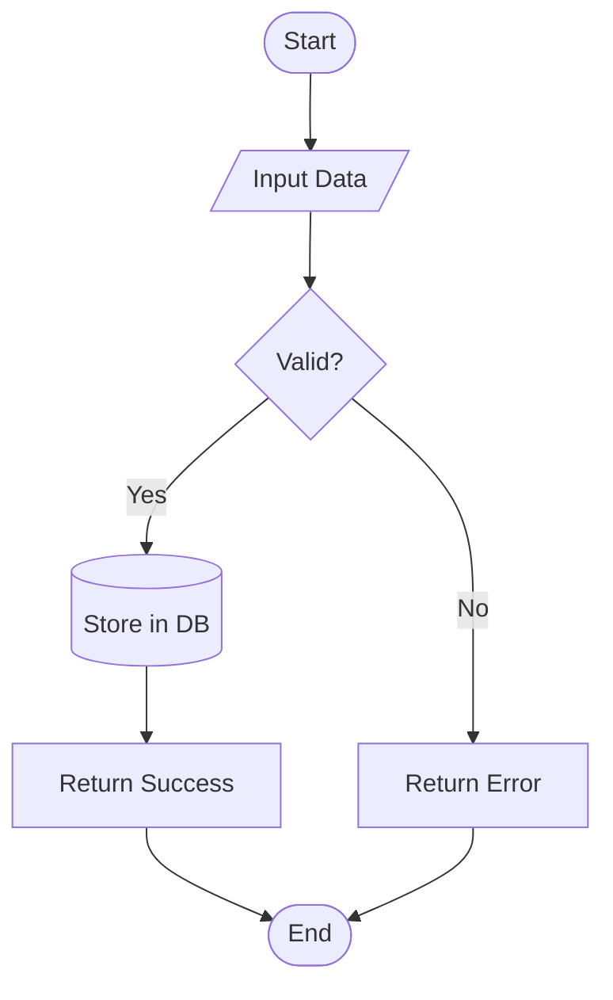

# Code Highlighting and Diagram Test

This page tests the code highlighting and diagram support configured in MkDocs.

## Python Code Example

```python
def hello_world():
    """A simple Python function."""
    print("Hello, World!")
    return True

class AWSService:
    def __init__(self, name, region):
        self.name = name
        self.region = region
    
    def describe(self):
        return f"{self.name} in {self.region}"
```

## JavaScript Code Example

```javascript
// AWS Lambda function example
exports.handler = async (event) => {
    const response = {
        statusCode: 200,
        body: JSON.stringify('Hello from Lambda!'),
    };
    return response;
};

const fetchData = async (url) => {
    try {
        const response = await fetch(url);
        return await response.json();
    } catch (error) {
        console.error('Error:', error);
    }
};
```

## YAML Configuration Example

```yaml
# AWS CloudFormation template
AWSTemplateFormatVersion: '2010-09-09'
Description: Sample CloudFormation template

Resources:
  MyS3Bucket:
    Type: AWS::S3::Bucket
    Properties:
      BucketName: my-example-bucket
      VersioningConfiguration:
        Status: Enabled
      Tags:
        - Key: Environment
          Value: Production
```

## JSON Configuration Example

```json
{
  "Version": "2012-10-17",
  "Statement": [
    {
      "Effect": "Allow",
      "Action": [
        "s3:GetObject",
        "s3:PutObject"
      ],
      "Resource": "arn:aws:s3:::my-bucket/*"
    }
  ]
}
```

## Bash Script Example

```bash
#!/bin/bash
# AWS CLI script to list S3 buckets

echo "Listing all S3 buckets..."
aws s3 ls

# Create a new bucket
BUCKET_NAME="my-new-bucket-$(date +%s)"
aws s3 mb s3://$BUCKET_NAME

# Upload a file
echo "Hello World" > test.txt
aws s3 cp test.txt s3://$BUCKET_NAME/

echo "Done!"
```

## Mermaid Diagram Example - Architecture



## Mermaid Diagram Example - Sequence



## Mermaid Diagram Example - Flowchart



## Code with Line Numbers and Copy Button

The code blocks above should have:
- Syntax highlighting for each language
- Copy button in the top-right corner
- Line numbers (when enabled)
- Proper indentation and formatting
